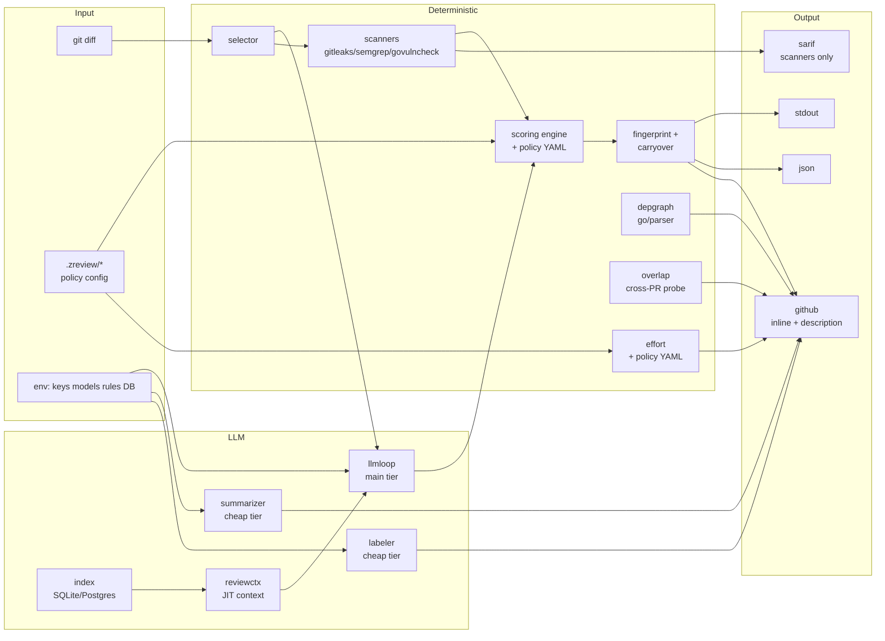
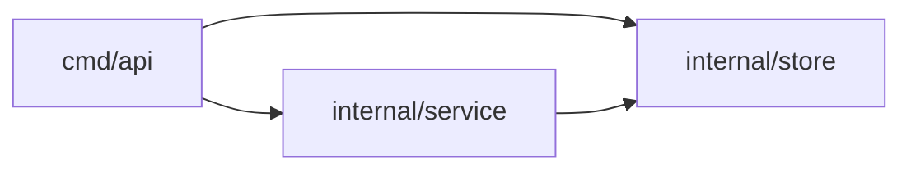

<div align="center">
  <h1>z-code-reviewer</h1>
  <p><strong>An AI-powered code review CLI &mdash; deterministic engineering wrapped around a thin agent loop.</strong></p>
</div>

<p align="center">
  <a href="https://github.com/shubam-disseqt/z-code-reviewer/actions/workflows/ci.yml"></a>
  <a href="https://github.com/shubam-disseqt/z-code-reviewer/actions/workflows/govulncheck.yml"></a>
  <a href="LICENSE"></a>
  
  
</p>
<p align="center">
  <a href="#supported-platforms"></a>
  <a href="#supported-platforms"></a>
  <a href="#supported-platforms"></a>
</p>
<p align="center">
  <a href="#providers"></a>
  <a href="#providers"></a>
  <a href="#providers"></a>
  <a href="#providers"></a>
</p>

---

## Table of contents

- [What is z-code-reviewer](#what-is-z-code-reviewer)
- [Feature matrix](#feature-matrix)
- [Quick start](#quick-start)
- [Architecture](#architecture)
- [Review pipeline (13 stages)](#review-pipeline)
- [Commands](#commands)
- [Configuration](#configuration)
- [Output formats](#output-formats)
- [Effort scoring](#effort-scoring)
- [Suggestion mode](#suggestion-mode)
- [Overlap detection](#overlap-detection)
- [Scanners](#scanners)
- [Depgraph](#depgraph)
- [Model tiering](#model-tiering)
- [LLM loop](#llm-loop)
- [Package map](#package-map)
- [Audit results](#audit-results)
- [Providers](#providers)
- [Development](#development)
- [Roadmap](#roadmap)
- [Attribution](#attribution)

---

## What is z-code-reviewer

**zreview** is a single-binary AI PR reviewer. It reads a git diff, runs deterministic scanners, drives a small LLM agent loop over each file, deduplicates findings across pushes, scores reviewer effort, renders a package-import diagram, and posts either inline PR comments (GitHub), a JSON report, a SARIF file, or plain-text summary.

**Design axes:**

- **Deterministic engineering, thin LLM loop.** Scanners, scoring, fingerprints, depgraph, effort math, and dedup are all deterministic Go. The LLM only sees each file's diff plus targeted read/search tools and emits `code_comment`/`task_done`.
- **Two-tier model routing.** Main tier (Sonnet-class) drives the review. Cheap tier (Haiku/Flash/DeepSeek) drives the summarizer and labeler in parallel. ~30-40% cost savings measured vs single-tier.
- **Incremental re-review.** Every finding carries a stable content-hash fingerprint. Push a fix commit → resolved findings drop, unfixed carry, new bugs surface. Stale zreview comments are cleaned up before posting fresh ones.
- **Every claim in the PR body is auditable.** Effort table rows sum to the shown score. Depgraph edges map to literal `import` lines. Labels defensible from touched paths. No LLM-fabricated content.
- **Two output modes.** Bug/security/perf **findings** and proactive **suggestions** delivered as GitHub `suggestion` markdown blocks that reviewers apply with one click.

**What zreview is NOT:**

- Not a static analyzer replacement — it runs Gitleaks / Semgrep / govulncheck alongside the LLM and routes their output to SARIF.
- Not a chat interface — no conversational surface; every run is one CLI invocation with deterministic inputs and outputs.
- Not a code-generation tool — it never writes commits itself. Suggestion blocks let reviewers accept fixes via the GitHub UI.

---

## Feature matrix

| Feature | Status | Notes |
|---|---|---|
| Bug/security/perf findings via LLM | supported | Main tier, tool-loop, one file at a time |
| Inline PR comments (GitHub) | supported | Batched review-post; stale-cleanup via fingerprint markers |
| JSON output | supported | Structured envelope with severity/confidence/impact/state |
| SARIF output (GitHub Code Scanning) | supported | Scanner findings only; LLM findings stay in-band |
| Deterministic scanners | supported | Gitleaks, Semgrep, govulncheck (best-effort, gracefully absent) |
| Content-hash fingerprints | supported | Whitespace/comment-stable; enables incremental re-review |
| Carryover across pushes | supported | Resolved/carried/new counts posted with every run |
| Reviewer-effort score 0-10 | supported | Deterministic, YAML-configurable, full audit table |
| Depgraph (import diagram) | supported | Parsed by `go/parser`, every edge = literal `import` |
| Overlap detection | supported | Cross-PR file-touch collisions surface in the description |
| Cheap-tier summarizer + labeler | supported | Parallel, JSON-structured, fault-tolerant |
| SQLite content-hash index | supported | Optional; skips re-indexing unchanged files |
| Session persistence + `--resume` | supported | JSONL append-only log with secret redaction |
| Code-quality suggestions | supported (v0.2) | GitHub `suggestion` markdown blocks; `.zreview/config.yaml` toggle |
| No-source-changes handling | supported | Docs-only / deps-only PRs get a `docs`/`chore` label + minimal block |
| Offline docs server | supported | `zreview docs` serves embedded HTML on loopback |
| Multi-provider LLM | supported | Anthropic, OpenAI, Bedrock, DeepSeek — single binary |

---

## Quick start

```bash
# Install
brew install shubam-disseqt/tap/zreview       # or: npm i -g zreview
# or download from releases: https://github.com/shubam-disseqt/z-code-reviewer/releases

# Configure your LLM
export ANTHROPIC_API_KEY=sk-ant-...            # or OPENAI_API_KEY
export ZREVIEW_MODEL=claude-sonnet-4-6         # main tier
export ZREVIEW_CHEAP_MODEL=claude-haiku-4-5    # cheap tier

# Review the current workspace diff
zreview review

# Review a branch
zreview review --from main --to feature/x

# Review a PR with inline comments (needs GITHUB_TOKEN)
export GITHUB_TOKEN=ghp_...
export GITHUB_REPOSITORY=owner/repo
zreview review --pr 42 --format github
```

---

## Architecture



- **Deterministic path** (scanners, scoring, fingerprints, effort, depgraph, overlap) never calls an LLM and always produces the same output for the same inputs.
- **LLM path** runs the main-tier reviewer per-file, plus cheap-tier summarizer + labeler in parallel with the review.
- **Emit** stitches everything together into the chosen output format.

---

## Review pipeline

`runReview()` in `cmd/zreview/review_cmd.go` runs 13 stages. Every stage wraps its error with a `stage:` prefix so a failure names the phase that hit it.

```mermaid
flowchart TD
    P0["0 · Load scoring +<br/>zconfig policy"]
    P1["1 · Resolve diff<br/>--from/--to / --commit / workspace"]
    P15["1.5 · No-reviewable-changes<br/>early return docs/deps PRs"]
    P2["2 · Selector<br/>drop binary/deleted/large"]
    P25["2.5 · Same as 1.5 if all filtered"]
    P3["3 · Index store<br/>optional SQLite"]
    P32["3.2 · Deterministic scanners<br/>gitleaks / semgrep / govulncheck"]
    P33["3.3 · Cheap-tier agents<br/>summarizer + labeler parallel"]
    P4["4 · Org rules load<br/>from external repo"]
    P5["5 · Repo context<br/>indexed OR JIT"]
    P6["6 · Session start<br/>or resume"]
    P7["7 · LLM tier resolve<br/>Main + Cheap client"]
    P8["8 · Prompts + tools load"]
    P9["9 · Tool registry"]
    P10["10 · LLM loop<br/>per file, tool-driven"]
    P11["11 · Post-process<br/>score, filter, dedup"]
    P115["11.5 · Carryover<br/>new/carried/resolved"]
    P12["12 · Overlap detect<br/>cross-PR"]
    P125["12.5 · Effort score 0-10"]
    P126["12.6 · Depgraph render"]
    P13["13 · Emit<br/>stdout/json/github/sarif"]

    P0 --> P1 --> P15 --> P2 --> P25 --> P3 --> P32 --> P33 --> P4 --> P5 --> P6 --> P7 --> P8 --> P9 --> P10 --> P11 --> P115 --> P12 --> P125 --> P126 --> P13
```



Every "best-effort" stage (scanners, cheap-tier, index, overlap, effort, depgraph) is fault-tolerant — a failure logs a WARN and continues with empty/default output. Only diff, scoring, session, LLM, prompts, tools, and emit are fatal.

---

## Commands

| Command | Purpose | Key flags |
|---|---|---|
| `zreview review` | Run the full review pipeline | `--from`, `--to`, `--commit`, `--pr`, `--format`, `--output`, `--min-severity`, `--resume`, `--verbose`, `--wait-sarif` |
| `zreview index` | Build/refresh SQLite code index | `--repo`, `--full`, `--paths` |
| `zreview overlap` | Detect cross-PR collisions | `--owner`, `--repo`, `--pr` |
| `zreview rules list` | List loaded org rules | `--source` |
| `zreview rules sync` | Force-refresh org rules cache | — |
| `zreview doctor` | Pre-flight environment check | — |
| `zreview docs` | Serve embedded offline docs (loopback only) | `--addr`, `--open` |
| `zreview version` | Print version / commit / build info | — |

**Diff-mode selection is mutually exclusive:**
- `--commit <sha>` → single-commit
- `--from <base> --to <head>` → range
- neither → current workspace

**Exit codes:**
- `0` — success, no blockers
- `1` — general error (CLI validation, fatal pipeline stage, untyped)
- `3` — one or more CRITICAL findings

---

## Configuration

Three layers, in decreasing precedence:

**1. CLI flags** — see [Commands](#commands).

**2. Environment variables** (grouped by purpose):

| Category | Var | Purpose |
|---|---|---|
| **LLM auth** | `ANTHROPIC_API_KEY` | Anthropic Claude auth |
| | `OPENAI_API_KEY` | OpenAI Chat Completions |
| | `OPENAI_RESPONSES_API_KEY` | OpenAI Responses API |
| | `DEEPSEEK_API_KEY` | DeepSeek auth |
| | `AWS_REGION` + `AWS_PROFILE` + `AWS_BEARER_TOKEN_BEDROCK` | Bedrock |
| **Model routing** | `ZREVIEW_PROVIDER` | Main-tier provider |
| | `ZREVIEW_MODEL` | Main-tier model |
| | `ZREVIEW_CHEAP_PROVIDER` | Cheap-tier provider (defaults to main) |
| | `ZREVIEW_CHEAP_MODEL` | Cheap-tier model (defaults to main) |
| **Storage** | `ZREVIEW_SESSION_DIR` | Session log dir (default `~/.zreview/sessions`) |
| | `ZREVIEW_FINDINGS_DIR` | Findings cache (default `~/.zreview/findings`) |
| | `ZREVIEW_DB_URL` | SQLite/Postgres index DSN |
| **Policy** | `ZREVIEW_SCORING_POLICY` | Override scoring policy YAML path |
| | `ZREVIEW_EFFORT_POLICY` | Override effort policy YAML path |
| | `ZREVIEW_ORG_RULES_REPO` | Org-rules git spec |
| **Feature gates** | `ZREVIEW_UPLOAD_SARIF=1` | Enable SARIF upload |
| | `ZREVIEW_OVERLAP_ENABLED=0` | Disable overlap detection |
| | `ZREVIEW_DISABLE_SCANNERS` | Comma list: `gitleaks,semgrep,govulncheck` |
| | `ZREVIEW_LOG_FORMAT` | `text` (default) or `json` |
| **GitHub** | `GITHUB_TOKEN` | PR posting, overlap, SARIF upload |
| | `GITHUB_REPOSITORY` | `owner/repo` for cross-PR context |
| | `GITHUB_REF` | Git ref for SARIF upload |

The Alibaba-compatible `OCR_LLM_*` vars are still honored for the ported skeleton — see [`docs/PORTING.md`](docs/PORTING.md).

**3. Repo-local YAML files** under `<repo>/.zreview/`:

| File | Purpose |
|---|---|
| `.zreview/config.yaml` | User toggles: `suggestions.enabled`, `suggestions.blocking` |
| `.zreview/scoring.yaml` | Per-repo scoring policy overrides |
| `.zreview/effort.yaml` | Per-repo effort weights |

Missing or malformed files log a WARN and fall back to the embedded defaults.

---

## Output formats

### `--format stdout` (default)
Human-readable text, ANSI-colored, listed by severity. Good for local diagnosis. No writes to GitHub.

### `--format json`
Structured envelope suitable for CI / dashboards:

```json
{
  "session_id": "...",
  "comments": [
    {
      "path": "internal/auth/session.go",
      "start_line": 17, "end_line": 17,
      "severity": "high",
      "category": "security",
      "content": "8-byte token is insufficient entropy — use 32 bytes",
      "existing_code": "raw := make([]byte, 8)",
      "suggestion_code": "raw := make([]byte, 32)",
      "state": "new",
      "scored": { "severity": "HIGH", "confidence": 0.9, "impact": 0.7 }
    }
  ],
  "summary": { "walkthrough": "...", "risk": "high: ..." },
  "labels": { "pr_type": "feat", "risk_tag": "risk/high" },
  "overlap": []
}
```

### `--format github`
Posts **inline PR comments** on the diff hunks + **updates the PR description** with a managed block containing: effort score + audit table, walkthrough paragraph, scanner findings table, severity table, risk tag, change groups, testing notes, package-imports Mermaid diagram, cross-PR overlap block.

- Inline comments batched via `POST /pulls/{n}/reviews` (avoids per-comment secondary rate limits)
- Stale zreview comments identified via `<!-- zreview:fp:HEX -->` marker and deleted before posting fresh set
- Labels (pr_type, domains, risk_tag, ownership_hints) applied with stale-cleanup on risk/* and pr_type namespaces

### `--format sarif`
SARIF 2.1.0 with **scanner findings only**. LLM findings stay in-band. Upload with `ZREVIEW_UPLOAD_SARIF=1` to publish to GitHub Code Scanning.

---

## Effort scoring

Every review produces a **0-10 reviewer-effort score** with a full audit table. The math is deterministic and reproducible: same diff + same policy → same score every time.

**Policy** (`internal/effort/policy.yaml`, overridable via `.zreview/effort.yaml`):

```yaml
base: 0.5
loc_churn:      { points_per_10_lines: 0.05, cap: 2.5 }
files_changed:  { points_per_file: 0.05,     cap: 1.5 }
new_files:      { points_per_file: 0.10,     cap: 1.5 }
max_file_churn: { points_per_10_lines: 0.03, cap: 1.0 }
test_ratio:     { bonus_at_25pct: -0.5, bonus_at_50pct: -1.0 }
paths:
  auth: 1.5          # files under auth/session/token/tls/etc
  migration: 1.5     # .sql, migrations/, schema
  infra: 1.0         # Dockerfile, k8s, terraform
overlap:  { points_per_pr: 0.5,  cap: 1.5 }
findings: { points_per_critical: 1.5, points_per_high: 0.75, points_per_medium: 0.30, points_per_low: 0.05, cap: 4.0 }
```

**Traffic light:**

| Score | Label | Dot |
|---|---|---|
| 0-2 | trivial | green |
| 3-4 | light | green |
| 5-6 | medium | yellow |
| 7-8 | medium-high | yellow |
| 9-10 | heavy | red |

Every table row shown in the PR description exists because a signal actually fired; test-ratio row shows a negative contribution when there are enough test files. On the 10-PR audit, all 8 productive PRs had table rows summing to the shown score within ±0.05.

---

## Suggestion mode

Beyond bugs, zreview emits **proactive improvement suggestions** as GitHub `suggestion` markdown blocks. Reviewers click **Commit suggestion** to apply the fix directly — zero custom UI.

**Delivered categories:**
- Extract helper (repeated ≥3-line block → function)
- Guard-clause conversion (nested `if/else` → early return)
- Error wrapping (`return err` → `fmt.Errorf("op: %w", err)`)
- Idiomatic Go (`for i := 0; i < len(s); i++` → `for i, v := range s`)
- Naming (generic `x`/`tmp`/`data` → domain-specific)
- Missing test cases (new exported function → 1 table-driven test)
- Missing docs (new exported symbol → 1-line doc)

**Rules:**
- `severity: "low"` + `category ∈ {style, maintainability, test, documentation}`
- `existing_code` must be verbatim; `suggestion_code` must compile in place
- Caps: **5 per file**, **20 per PR** total (bugs uncapped)
- Never suggests logic changes, control flow, or subjective preference

**Toggle:**

```yaml
# .zreview/config.yaml
suggestions:
  enabled: true     # default
  blocking: false   # default — suggestions never break CI
```

**Rendered output on GitHub:**

````
**[nit]** **[low / style]** Early returns keep the happy path un-indented.

```suggestion
if user == nil {
    return errNilUser
}
if !user.Active {
    return errInactive
}
return process(user)
```
````

---

## Overlap detection

When multiple open PRs touch the same files, zreview surfaces a block in the PR description:

```
> Potential overlap with other open PRs — these may be stepping on this one:
> - #9 (merge-conflict risk) — Both PRs modify internal/legacy/*
> - #3 (merge-conflict risk) — Both PRs modify auth middleware
```

Off unless `GITHUB_TOKEN` is set. Disable with `ZREVIEW_OVERLAP_ENABLED=0`. Contributes up to `+1.5` to the effort score.

---

## Scanners

Best-effort integration with deterministic tools:

| Scanner | What it finds | Routing |
|---|---|---|
| **gitleaks** | Hardcoded secrets, API tokens | SARIF (never inline) |
| **semgrep** | Pattern-based bug/security rules | SARIF |
| **govulncheck** | Known CVEs in Go dependencies | SARIF |

- Runs in parallel with bounded concurrency
- Missing binaries logged as `skipping <tool> (not installed)` — never fatal
- Disable specific ones via `ZREVIEW_DISABLE_SCANNERS=semgrep,govulncheck`
- Findings tagged `source: "scanner:<tool>"`; the scoring engine's confidence bump for scanners is high

---

## Depgraph

Every PR that touches ≥2 Go packages with cross-package `import` lines gets a **package-import diagram** rendered as a Mermaid `flowchart LR` block. Every edge is a literal `import` line parsed by `go/parser` — **no LLM inference**.



Single-package PRs and non-Go PRs get no depgraph section (correctly omitted). Deterministic: same source → byte-identical Mermaid output.

---

## Model tiering

Two independent LLM clients per review:

| Tier | Env vars | Purpose | Cost profile |
|---|---|---|---|
| **Main** | `ZREVIEW_PROVIDER` + `ZREVIEW_MODEL` | Main task loop + memory compression | Sonnet-class |
| **Cheap** | `ZREVIEW_CHEAP_PROVIDER` + `ZREVIEW_CHEAP_MODEL` | Summarizer + labeler (parallel) | Haiku / Flash / DeepSeek |

**Routing logic** (`internal/llm/tiers.go`):
- Both env vars set → independent clients, separate HTTP pools
- Only `ZREVIEW_CHEAP_MODEL` set → reuse main client, override model per call
- Neither set → cheap == main (no cost savings)

Main tier has session-key affinity for prompt-cache reuse. Cheap tier does not.

---

## LLM loop

The main-task loop (`internal/llmloop/loop.go`) runs one review per file. Each iteration:

1. Send the current conversation to the model (prefix-extension for cache reuse)
2. Parse tool calls; if none, log retry, append "try again", loop
3. Execute each tool call
4. If memory usage crosses **60%** → trigger async compression; **80%** → sync emergency compression
5. Repeat until `task_done`, budget exhaustion, or context cancelled

**Available tools** (`internal/tool/tools.json`, embedded):

| Tool | When | Purpose |
|---|---|---|
| `code_comment` | main_task | Emit a finding with severity/category/content, optional `suggestion_code` |
| `task_done` | main_task | Signal "no more findings"; state=DONE or FAILED |
| `code_search` | plan + main | Regex/literal search across the repo; capped at 100 hits |
| `file_read` | main_task | Read a file with optional line range; capped at 500 lines/call |
| `file_read_diff` | plan + main | View unified diffs for one or more paths |
| `file_find` | plan + main | Find files by name/pattern; basename-first matching |

**Budgets:**
- **Round budget**: 100 rounds default per file
- **Empty-round budget**: 3 consecutive rounds with no tool call → stop
- **Token budget**: 80% of context = hard stop
- **Grace round**: one final call with just `code_comment` + `task_done` if round budget hits zero

---

## Package map

34 internal packages. Every package has tests.

| Package | Purpose | Key exports |
|---|---|---|
| `chunker` | Token-bounded diff batching | `Chunk`, `Item` |
| `comment` | Parse LLM comments from tool call args | `ParseComments` |
| `conventions` | Load `AGENTS.md`/`CONTRIBUTING.md` into prompts | `Load`, `Markdown` |
| `depgraph` | Deterministic Mermaid import diagram | `Render`, `File`, `Options` |
| `diff` | Parse git diffs, resolve line numbers | `Resolve`, `Hunk`, `Mode` |
| `docsserver` | Loopback-only offline docs HTTP server | `Start`, `Options` |
| `effort` | Compute 0-10 reviewer effort | `Compute`, `Score`, `Inputs` |
| `extract` | Per-language AST extraction (Go/Py/JS/…) | `Extract`, `Registry` |
| `filetype` | Path → language mapping (20+ langs) | `FromPath`, `Language` |
| `filter` | Exclude patterns + generated-file detection | `ShouldInclude`, `IsGenerated` |
| `findings` | Per-PR JSON cache for carryover | `Load`, `Save`, `Store` |
| `fingerprint` | Content-hash finding identity | `Fingerprint`, `Input` |
| `gh` | GitHub REST client (posts, SARIF, PRs) | `Client`, `PostReview`, `UploadSARIF` |
| `gitcmd` | Semaphore-gated `git` subprocess runner | `Runner`, `Run`, `Stream` |
| `index` | LLM-summarized SQLite code index | `Indexer`, `Store`, `FileSummary` |
| `llm` | Multi-provider LLM client abstraction | `Client`, `CompletionsWithCtx` |
| `llmloop` | Per-file review loop | `Runner`, `Deps`, `Template` |
| `logutil` | slog wrapper (text/JSON, staged) | `New`, `FromEnv`, `WithStage` |
| `manifests` | Package-lockfile parsers (npm, pip, go, cargo…) | `Parser`, `Registry`, `Dependency` |
| `model` | Core types (`LlmComment`, `Diff`, `Summary`, `Labels`) | Everything data-shaped |
| `overlap` | Cross-PR overlap probe | `Detect`, `Finding`, `Config` |
| `pathutil` | Canonical + within-base path helpers | `CanonicalPath`, `WithinBase` |
| `prompts` | Embedded prompt templates | `Templates` (embed.FS) |
| `reviewctx` | Codebase context (indexed + JIT) | `Build`, `BuildIndexed`, `BuildJIT` |
| `rules` | Org rules loader from git repo | `Loader`, `Load` |
| `sarif` | SARIF 2.1.0 encoder | `Encode`, `Finding` |
| `scanner` | Adapters for gitleaks/semgrep/govulncheck | `Run`, `Runner`, `ScannerFinding` |
| `scoring` | Category+rule → severity policy | `ScoreOne`, `Policy`, `IsSuggestion`, `FilterBlocking` |
| `selector` | Pre-dispatch file filter | `Select`, `Decision` |
| `session` | Append-only JSONL run log | `Session`, `TaskRecord` |
| `tool` | Load embedded tool definitions | `LoadToolsConfig`, `Registry` |
| `zconfig` | Load `.zreview/config.yaml` toggles | `Load`, `Default`, `Config` |

**Layer view:**

```
Data:      filetype, model, filter, pathutil
Diff/git:  diff, gitcmd, rules
LLM:       llm, llmloop, index (summarizer), tool, prompts
Context:   reviewctx, index
Rules/Cfg: rules, zconfig, scoring, effort
Findings:  comment, fingerprint, findings, scanner
Output:    gh, sarif, session, depgraph, overlap
Utility:   chunker, conventions, docsserver, extract, logutil, manifests, selector
```

---

## Audit results

Latest 10-PR + 1 mega-PR audit (Sep 2026, gpt-4o-mini):

| Metric | Result |
|---|---|
| Bugs seeded / caught | **21 / 21 → 100% recall** |
| False positives | **~1 per 10 findings** |
| Loop closure (fix → resolved) | **4/4** PRs with bugs closed cleanly |
| Effort table sum vs shown score | **exact** (or correctly clamped at 10) |
| Depgraph edge honesty | **100%** — every edge maps to literal `import` |
| Labels defensibility | **all defensible** across 39 applied |
| Score directionality on fix | **always drops** after real fix |
| Total cost | **~$0.09** across 22 productive runs |
| Per-PR cost | **~$0.006** average |

**Verified features per archetype:** trivial docs (silent-block emitted), small clean feat, small bug-heavy, cross-pkg refactor (depgraph), auth-touching (`paths.auth +1.5`), migration (`paths.migration +1.5`), test-heavy (`test_ratio -1.0`), large clean feat (size caps hold), large bug-heavy (findings cap engages), deps update (chore label).

**Known gaps:** LLM tier at gpt-4o-mini under-produces suggestions on clean files; effort calibration slightly cold on lone small feats; occasional duplicate finding on same line at very small quality tier.

---

## Providers

| Provider | Auth env | Notes |
|---|---|---|
| **Anthropic** | `ANTHROPIC_API_KEY` | Claude Sonnet 4.6 / Opus 4.7 / Haiku 4.5 |
| **OpenAI** | `OPENAI_API_KEY` | GPT-4o, GPT-4o-mini, o1, o3-mini |
| **OpenAI Responses** | `OPENAI_RESPONSES_API_KEY` | For Responses API endpoints |
| **AWS Bedrock** | `AWS_REGION`, `AWS_PROFILE` / `AWS_BEARER_TOKEN_BEDROCK` | Claude via Bedrock |
| **DeepSeek** | `DEEPSEEK_API_KEY` | Low-cost cheap-tier option |

Recommended pairs:
- **Best quality**: Sonnet 4.6 (main) + Haiku 4.5 (cheap)
- **Best cost**: GPT-4o-mini (main) + DeepSeek-chat (cheap)
- **Best balance**: Sonnet 4.6 (main) + GPT-4o-mini (cheap)

---

## Development

```bash
# Clone
git clone git@github.com:shubam-disseqt/z-code-reviewer.git
cd z-code-reviewer

# Build
go build ./cmd/zreview

# Test (34 packages, all covered)
go test ./...

# Test with race detector
go test -race ./...

# Run locally against this repo
./zreview review --from main --to HEAD
```

**Contributing:** read [`AGENTS.md`](AGENTS.md) — it covers the rules for AI-assisted PRs (disclosure, self-review, no attribution trailers, no LICENSE edits via AI).

**Project layout:**

```
cmd/zreview/           # CLI entry + review pipeline glue
internal/              # 34 focused packages (see Package map above)
docs/                  # Offline HTML docs (embedded into binary)
  PORTING.md           # Per-file attribution to alibaba/open-code-review
  THREAT_MODEL.md      # Attack surface + mitigations
  ARCHITECTURE.md      # Longer architectural walkthrough
ROADMAP.md             # Phase-by-phase status
AGENTS.md              # Rules for AI-assisted contributions
```

---

## Roadmap

Recent phases:

- **Phase 12** — Model tiering (main + cheap), incremental re-review via fingerprints (done)
- **Phase 13** — Deterministic scanners (gitleaks/semgrep/govulncheck), SARIF output (done)
- **Phase 14** — Cheap-tier summarizer + labeler agents (done)
- **Phase 15** — Overlap detection, org-rules loader (done)
- **Phase 16** — Scoring engine with policy YAML (done)
- **Phase 17** — GitHub PR description block, effort score, depgraph (done)
- **Phase 18** — Suggestion mode, no-source-changes handling, zconfig (done)
- **Phase 19** — Prompt quality tuning at cheap-tier models (in progress)
- **Phase 20** — v1.0 pilot: run zreview on this repo for one week; ship v1

See [`ROADMAP.md`](ROADMAP.md) for the full history.

---

## Attribution

`zreview` would not exist without the work of two upstream open-source projects, both under Apache-2.0:

- [alibaba/open-code-review](https://github.com/alibaba/open-code-review) — the diff-precision layer, tool loop, prompt templates, and comment-args-repair logic.
- [miracodeai/mira](https://github.com/miracodeai/mira) — the persistent code index, JIT cross-file context, cross-PR overlap detector, and business-rules injection surface.

Per-file attribution: [NOTICE](NOTICE). Detailed port map: [docs/PORTING.md](docs/PORTING.md).
