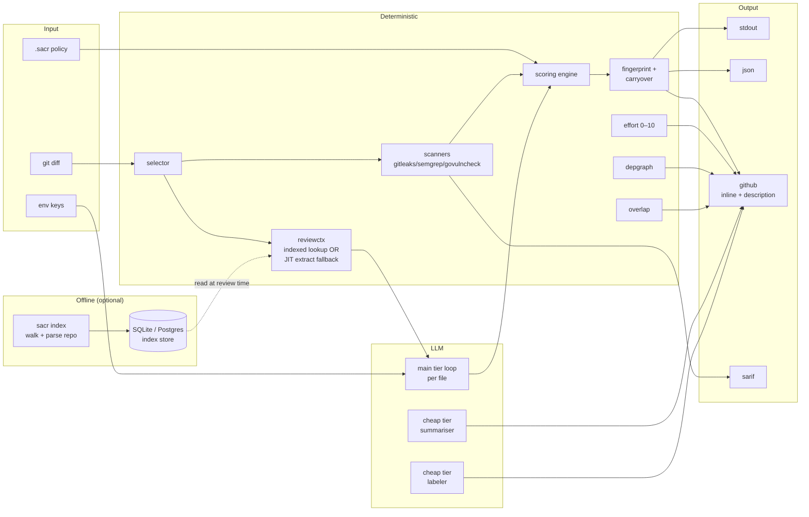
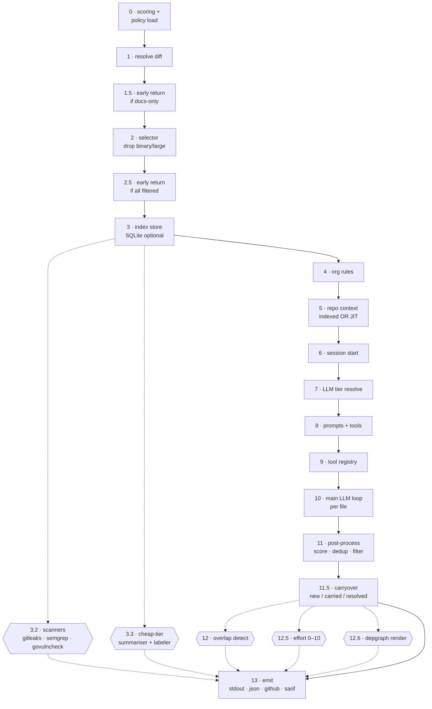

<div align="center">

# sacr

**AI code review that ships with your PRs.**
Deterministic engineering wrapped around a thin agent loop. One Go binary. Real bugs, not noise.

[](https://github.com/shubam-disseqt/shubam-ai-code-reviewer/actions/workflows/ci.yml)
[](https://github.com/shubam-disseqt/shubam-ai-code-reviewer/actions/workflows/govulncheck.yml)
[](LICENSE)
[](go.mod)
[](https://slsa.dev)

**[Website](https://shubam-disseqt.github.io/shubam-ai-code-reviewer/)** · **[Docs](https://shubam-disseqt.github.io/shubam-ai-code-reviewer/docs)** · [Quickstart](#quick-start) · [Architecture](#architecture) · [Integrate](#integrate) · [Roadmap](ROADMAP.md)

</div>

---

## At a glance

|  |  |
|---|---|
| **Recall** | 21 / 21 seeded bugs caught on the 10-PR audit (100%) |
| **Precision** | ~1 false positive per 10 findings |
| **Cost** | ~$0.006 per PR at `gpt-4o-mini` · ~$220/year at 100 PRs/day |
| **Latency** | Median 20–30 s per PR · 150 s on a 40-file mega PR |
| **Providers** | Anthropic · OpenAI · AWS Bedrock · DeepSeek |
| **Languages** | Go · TypeScript · Python · Ruby · JavaScript |
| **Platforms** | Linux · macOS · Windows |
| **Distribution** | Homebrew · npm · Docker · GitHub Action · direct binary |

---

## Quick start

```bash
# 1. Install
brew install shubam-disseqt/tap/sacr      # or: npm i -g sacr

# 2. Configure the LLM
export OPENAI_API_KEY=sk-...
export SACR_MODEL=gpt-4o-mini             # or claude-sonnet-4-6

# 3. Review a diff
sacr review                               # workspace diff (uncommitted)
sacr review --from main --to feature/x    # branch range
sacr review --commit abc123               # single commit

# 4. Post to a GitHub PR
export GITHUB_TOKEN=ghp_...
export GITHUB_REPOSITORY=owner/repo
sacr review --pr 42 --format github
```

Three lines. Every PR gets inline review, effort score, and a real
import-graph diagram. Push a fix commit — resolved findings drop, unfixed
ones carry, new bugs surface. No stale spam.

---

## What it does

Every `sacr review` produces the same set of artefacts — no configuration required.

### Inline PR comments on the exact lines

Every finding lands as a targeted inline comment on the vulnerable line. All findings for a run are batched into a single `POST /pulls/{n}/reviews` call so a 40-file PR doesn't trip GitHub's secondary rate limits. LLM line numbers are snapped to the actual diff by a deterministic post-processor — a model that emits `line: 47` for code that lives at line 45 gets pulled back into the diff hunk so the anchor lands where a reviewer looks. Fingerprint markers (`<!-- sacr:fp:HEX -->`) let reruns purge stale comments cleanly; no duplicate audit trail.

### Separate PR-level review summary

At the end of every run, sacr posts a PR-level comment authored by `github-actions[bot]` containing the change walkthrough, findings table, effort score, package map, and risk assessment. The comment is idempotent via a `<!-- sacr:fp:summary -->` fingerprint — the next run lists issue comments, deletes any previous marker-tagged post, and creates a fresh one. The human-authored PR body is never edited.

### Reviewer-effort score (0–10)

A weighted sum over four signals: LOC changed, files touched, cyclomatic-complexity delta, and cross-package boundary crossings. Every score ships with a full audit table where each row shows the raw metric, the weight applied, and the contribution to the final number. Every row sums to the shown value — no fudge factor.

### Package-imports Mermaid diagram

Parses every changed source file with `go/parser` (Go), tree-sitter (TypeScript, JavaScript), or a language-specific regex (Python, Ruby) and emits a Mermaid diagram of the import edges between packages touched by the diff. Every edge in the rendered diagram corresponds to a literal import statement — no inferred coupling, no LLM-generated edges. Reviewers can trace ownership by reading the imports.

### Cross-PR overlap detection

When a PR opens, sacr fetches the list of other open PRs, computes a Jaccard similarity on `(title tokens ∪ changed files ∪ changed symbols)` against each candidate, keeps only pairs above a threshold, then asks the LLM for a per-pair verdict on merge-conflict risk and owner-of-record. The deterministic prefilter keeps token cost bounded even on repos with hundreds of open PRs.

### Committable suggestion blocks

A subset of findings — extract-helper, guard-clause conversion, error-wrap improvements, missing docs on exported symbols — land as GitHub's native suggestion blocks. The `existing_code` is copied verbatim from the diff and the `suggestion_code` is a syntactically valid replacement; reviewers click **Commit suggestion** to apply the fix directly on the branch. Sacr only emits a suggestion when the replacement is deterministic and safe; ambiguous cases stay as regular comments.

### SARIF 2.1.0 for GitHub Code Scanning

Deterministic-scanner findings (gitleaks credentials, semgrep patterns, govulncheck CVEs) are also written as a SARIF 2.1.0 document. GitHub Code Scanning ingests it and surfaces the findings in the Security tab with alert-state tracking across pushes — a resolved finding stays resolved, a reintroduced one reopens automatically. Enable with `SACR_UPLOAD_SARIF=1` in the workflow.

### Deterministic scanners as tier 0

`gitleaks`, `semgrep`, and `govulncheck` run as pure Go subprocess wrappers before any LLM call. Zero token cost, near-perfect precision on the categories they cover. Their findings feed the LLM's context as "known issues" so the LLM never duplicates them, and pass through to the SARIF and `github` outputs unchanged. `govulncheck` findings are filtered by call-graph reachability so unreachable CVEs don't page you.

### Two-tier LLM routing

Sacr splits LLM work into a **main tier** (per-file review, ~90% of token cost) and a **cheap tier** (walkthrough summariser + PR labeler, ~10% of cost). The main tier defaults to a strong model (Sonnet-class or `gpt-4o-mini`); the cheap tier can be `Haiku`, `DeepSeek`, or `Gemini Flash`. Pairing saves ~30–40% on total review cost with no measurable recall loss.

### Fingerprint-based carryover across runs

Every finding is hashed on `(path, category, fixed_severity, sanitized_body)`. On rerun, sacr diffs the new finding set against the previous run's fingerprints and marks each as `new`, `carried`, or `resolved`. Resolved findings disappear from the PR cleanly; unfixed ones stay put without triggering re-notification. No stale spam even after 30 pushes.

### Persistent index with JIT fallback

`sacr index` builds a per-repo SQLite (or your own Postgres) store containing per-file summaries, symbol maps, import graphs, and manifests. At review time, `reviewctx` reads the index for indexed mode (fast, cross-file). When no index is available, the same context shape is reconstructed on-demand via `file_read`, `file_find`, and `code_search` tool calls (JIT mode — fewer moving parts, higher token cost). Both modes emit the same prompt so the LLM path cannot tell them apart.

### Org-level review rules

Team review policy lives in a YAML file in a git repo (`SACR_ORG_RULES_REPO`). Rules are scope-filtered by file path, tagged with severity + category, and injected into the reviewer prompt as constraints. Human-authored, human-reviewed via PR; the reviewer treats them as advisory guidance and every rule application still routes through the same scoring engine.

### Session log for audit and resume

Every review appends a JSONL log to `~/.sacr/sessions/<uuid>.jsonl`: `session_start`, one record per LLM request + response, one per tool call, one per finding produced, then `session_end`. The log is both the audit trail (what did the model see, what did it emit) and the resume input — a crashed run picks up from the last checkpoint without reissuing successful LLM calls.

### Structured labels

Every review computes and applies four label families: `pr_type` (`feat` / `fix` / `refactor` / `docs` / `test` / `chore` / `perf` / `ci`), `domains` (extracted from touched paths and symbol names), `risk_tag` (`risk/low` … `risk/critical`, derived from scoring + scanner findings), and `ownership_hints` (from CODEOWNERS or best-effort git blame). Exclusive families (`pr_type`, `risk_tag`) are cleaned up on rerun so stale labels don't accumulate.

---

## Design principles

Five choices that keep the tool honest. Full walkthrough in the
[architecture docs](https://shubam-disseqt.github.io/shubam-ai-code-reviewer/docs/architecture).

| Axis | Choice | Why |
|---|---|---|
| **Determinism** | Deterministic engineering wraps a thin LLM loop | Scanners, scoring, math, dedup all in Go — LLM only for judgement |
| **Auditability** | Every claim in the PR body is verifiable | Effort table rows sum to shown score; depgraph edges = literal imports |
| **Cost** | Two-tier model routing | Main tier for review; cheap tier for summariser and labeler; ~30–40% saved |
| **Idempotency** | Content-hash fingerprints | Fix commit → resolved findings drop cleanly; no re-run noise |
| **Distribution** | Single Go binary | No Python runtime, no LangChain, no service to deploy |

---

## Architecture



**Two layers with different guarantees:**

- **Deterministic path** — scanners, scoring, fingerprints, effort, depgraph, overlap. All Go. Same input → same output every run. Reproducible, auditable, cheap.
- **LLM path** — main-tier reviewer per file, plus cheap-tier summariser + labeler in parallel. Judgement calls the deterministic path cannot make.

The LLM sees each file's diff and a small set of read/search tools; it emits
`code_comment` or `task_done`. That's it — no agent chains, no reasoning
loops, no LangGraph.

### 13-stage review pipeline

Every `runReview()` call executes these stages in order. Each stage wraps its error with a `stage:` prefix so a failure names the phase. Dashed edges are best-effort — a failure on those logs a warning, returns an empty result, and the run continues.



**Fatal stages** (abort with wrapped error): diff, scoring, session, LLM, prompts, tools, emit.
**Fault-tolerant stages** (log warning, continue with empty result): scanners, cheap-tier agents, index, overlap, effort, depgraph.

Full package map + trust-boundary breakdown: [architecture docs](https://shubam-disseqt.github.io/shubam-ai-code-reviewer/docs/architecture/pipeline).

---

## Integrate

One binary, five distribution channels. Pick the one that already lives in
your pipeline.

### GitHub Action *(most common)*

```yaml
- uses: shubam-disseqt/shubam-ai-code-reviewer@v1
  with:
    pr-number: ${{ github.event.pull_request.number }}
    api-key: ${{ secrets.OPENAI_API_KEY }}
    github-token: ${{ secrets.GITHUB_TOKEN }}
```

### Homebrew

```bash
brew install shubam-disseqt/tap/sacr
sacr doctor                   # pre-flight environment check
sacr review --from main --to HEAD
```

### npm

```bash
npm i -g sacr
sacr review --pr 42 --format github
```

### Docker

```bash
docker run --rm -v "$PWD":/repo \
  -e OPENAI_API_KEY -e GITHUB_TOKEN \
  ghcr.io/shubam-disseqt/sacr:latest \
  review --pr 42 --format github
```

### Direct binary

Download from [releases](https://github.com/shubam-disseqt/shubam-ai-code-reviewer/releases) — Linux, macOS, Windows amd64/arm64. Verify via SLSA build provenance.

### VS Code

Extension skeleton lives in [`ide/vscode/`](ide/vscode/) — surfaces `sacr review` output in the Problems panel and diff gutters.

---

## Providers

| Provider | Auth | Notes |
|---|---|---|
| **Anthropic** | `ANTHROPIC_API_KEY` | Claude Sonnet 4.6 / Opus 4.7 / Haiku 4.5 |
| **OpenAI** | `OPENAI_API_KEY` | GPT-4o, GPT-4o-mini, o1, o3-mini |
| **OpenAI Responses** | `OPENAI_RESPONSES_API_KEY` | For Responses API endpoints |
| **AWS Bedrock** | `AWS_REGION` + `AWS_PROFILE` / SSO / IAM role | Claude via Bedrock — ambient AWS credential chain |
| **DeepSeek** | `DEEPSEEK_API_KEY` | Low-cost cheap-tier option (`deepseek-chat`, `deepseek-reasoner`) |

**Recommended pairings:**

- **Best quality** — Sonnet 4.6 (main) + Haiku 4.5 (cheap)
- **Best cost** — GPT-4o-mini (main) + DeepSeek-chat (cheap)
- **Best balance** — Sonnet 4.6 (main) + GPT-4o-mini (cheap)

Full provider setup: [providers docs](https://shubam-disseqt.github.io/shubam-ai-code-reviewer/docs/reference/providers).

---

## Configuration

Three layers, decreasing precedence:

1. **CLI flags** — `--from`, `--to`, `--commit`, `--pr`, `--format`, `--output`, `--min-severity`, `--resume`, `--verbose`
2. **Environment variables** — LLM auth, model routing, GitHub integration, feature gates ([full list](https://shubam-disseqt.github.io/shubam-ai-code-reviewer/docs/reference/configuration))
3. **Repo-local YAML** under `.sacr/` — `config.yaml` (suggestions on/off), `scoring.yaml` (severity policy override), `effort.yaml` (effort weights override)

Missing or malformed config falls back to embedded defaults.

---

## Output formats

| Format | Use case | Destination |
|---|---|---|
| `stdout` | Local diagnosis | Terminal (ANSI-colored) |
| `json` | CI / dashboards | File or stdout |
| `github` | PR review | Inline comments + description block + labels |
| `sarif` | GitHub Code Scanning | File; upload via `SACR_UPLOAD_SARIF=1` |

---

## Compared to alternatives

|  | sacr | CodeRabbit | Greptile | Ellipsis |
|---|---|---|---|---|
| Deployment | Single binary | SaaS | SaaS | SaaS |
| Cost per PR | ~$0.006 | $8–15 (flat) | $12/user/mo | $20/user/mo |
| Deterministic scoring | Yes | No | No | No |
| Auditable effort math | Yes | No | No | No |
| Depgraph from real imports | Yes | No | No | No |
| Cross-PR overlap detection | Yes | Partial | No | No |
| Local-only mode | Yes | No | No | No |
| Choice of LLM provider | 4 providers | Vendor-locked | Vendor-locked | Vendor-locked |
| Custom scoring policy | YAML | No | No | No |

sacr trades polish (no web dashboard, no chat interface) for **control**:
bring your own model, own the data, verify every claim.

---

## Development

```bash
git clone git@github.com:shubam-disseqt/shubam-ai-code-reviewer.git
cd shubam-ai-code-reviewer

go build ./cmd/sacr
go test ./...
go test -race ./...

./sacr review --from main --to HEAD    # dogfood
```

**Contributing:** read [`AGENTS.md`](AGENTS.md) for rules on AI-assisted PRs.

**Project layout:**

```
cmd/sacr/              CLI entry + pipeline glue
internal/              34 focused packages, all tested
docs/                  Offline HTML docs (embedded in the binary)
docs-site/             Fumadocs + Next.js public docs site
ide/vscode/            VS Code extension skeleton
marketing/site/        Editorial landing page (legacy)
packaging/             Homebrew formula + npm wrapper
ROADMAP.md             Phase-by-phase status
AGENTS.md              Rules for AI-assisted contributions
```

Full package map with purpose and key exports:
[architecture docs](https://shubam-disseqt.github.io/shubam-ai-code-reviewer/docs/architecture/pipeline).

---

<div align="center">

**Apache-2.0** · [Website](https://shubam-disseqt.github.io/shubam-ai-code-reviewer/) · [Documentation](https://shubam-disseqt.github.io/shubam-ai-code-reviewer/docs) · [Issues](https://github.com/shubam-disseqt/shubam-ai-code-reviewer/issues) · [Discussions](https://github.com/shubam-disseqt/shubam-ai-code-reviewer/discussions)

</div>
