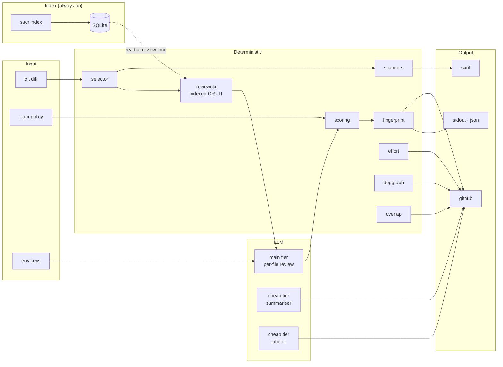
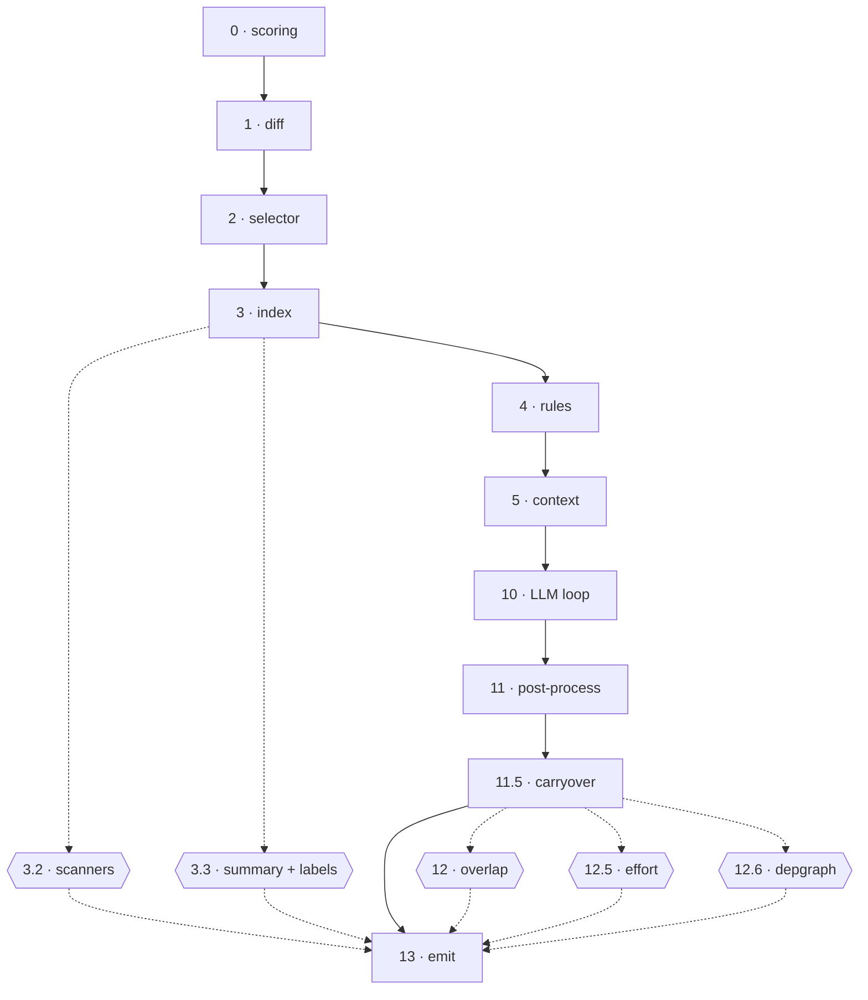

<div align="center">
  
# sacr

### AI code review that ships with your PRs

<sub>Deterministic engineering · thin agent loop · one Go binary · real bugs, not noise</sub>

<br>

[](https://github.com/shubam-disseqt/shubam-ai-code-reviewer/actions/workflows/ci.yml)
[](https://github.com/shubam-disseqt/shubam-ai-code-reviewer/actions/workflows/govulncheck.yml)
[](LICENSE)
[](go.mod)
[](https://slsa.dev)

**[Website](https://shubam-disseqt.github.io/shubam-ai-code-reviewer/)** · **[Docs](https://shubam-disseqt.github.io/shubam-ai-code-reviewer/docs)** · [Quickstart](#quick-start) · [Architecture](#architecture) · [Integrate](#integrate)

<br>

</div>

---

## Quick start

```bash
brew install shubam-disseqt/tap/sacr
export OPENAI_API_KEY=sk-...
sacr review --pr 42 --format github
```

Every PR gets inline review, effort score, package-imports diagram, and risk labels. Push a fix commit — resolved findings drop, unfixed carry, new bugs surface. Full flags: [CLI reference](https://shubam-disseqt.github.io/shubam-ai-code-reviewer/docs/reference/cli).

---

## Features

<table>
<tr>
<th align="left" width="34%">On the PR</th>
<th align="left" width="33%">Analysis</th>
<th align="left" width="33%">State across runs</th>
</tr>
<tr>
<td valign="top">

- **Inline comments** on exact lines
- **Summary comment** as bot
- **Committable suggestions**
- **Structured labels**

</td>
<td valign="top">

- **Effort score** 0–10
- **Package-imports** diagram
- **Deterministic scanners**<br/><sub>gitleaks · semgrep · govulncheck</sub>
- **SARIF 2.1.0** output
- **Two-tier LLM** routing
- **Cross-PR overlap** detection

</td>
<td valign="top">

- **Fingerprint carryover**
- **Always-on code index** (per-repo SQLite)
- **Org-level rules** (YAML)
- **Session log** (JSONL)

</td>
</tr>
</table>

Per-feature detail: [capabilities docs](https://shubam-disseqt.github.io/shubam-ai-code-reviewer/docs/capabilities).

---

## Architecture



Two layers, different guarantees. The **deterministic path** is pure Go: same input → same output. The **LLM path** handles only the judgement calls the deterministic side cannot make.

<details>
<summary><strong>13-stage pipeline</strong></summary>



**Fatal** (abort with wrapped error): diff, scoring, index store, session, LLM, prompts, tools, emit.
**Fault-tolerant** (warn + continue): scanners, cheap-tier agents, index summaries, overlap, effort, depgraph.

</details>

Full package map: [architecture docs](https://shubam-disseqt.github.io/shubam-ai-code-reviewer/docs/architecture/pipeline).

---

## Integrate

```yaml
- uses: shubam-disseqt/shubam-ai-code-reviewer@v1
  with:
    pr-number: ${{ github.event.pull_request.number }}
    api-key: ${{ secrets.OPENAI_API_KEY }}
    github-token: ${{ secrets.GITHUB_TOKEN }}
```

Homebrew · npm · Docker · direct binary: [installation docs](https://shubam-disseqt.github.io/shubam-ai-code-reviewer/docs/getting-started/installation).

---

## Why sacr

|  | sacr | CodeRabbit | Greptile | Ellipsis |
|---|:-:|:-:|:-:|:-:|
| Single binary | Yes | — | — | — |
| Deterministic scoring | Yes | — | — | — |
| Depgraph from real imports | Yes | — | — | — |
| Local-only mode | Yes | — | — | — |
| Choice of LLM provider | 4 | 1 | 1 | 1 |
| Cost per PR | **~$0.006** | $8–15 flat | $12/user/mo | $20/user/mo |

Bring your own model. Own the data. Verify every claim.

---

<div align="center">

**Apache-2.0**
[Website](https://shubam-disseqt.github.io/shubam-ai-code-reviewer/) · [Docs](https://shubam-disseqt.github.io/shubam-ai-code-reviewer/docs) · [Issues](https://github.com/shubam-disseqt/shubam-ai-code-reviewer/issues) · [Discussions](https://github.com/shubam-disseqt/shubam-ai-code-reviewer/discussions) · [Roadmap](ROADMAP.md)

</div>
