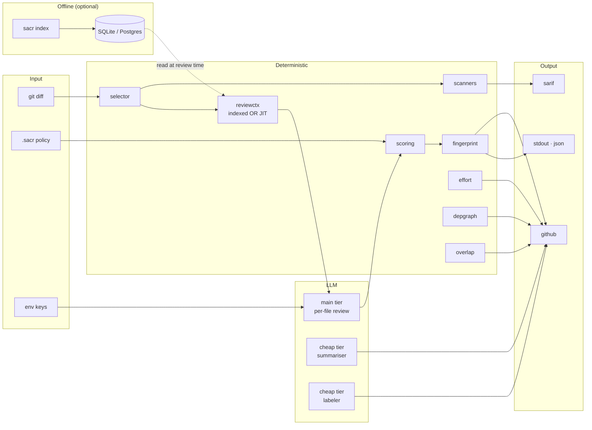
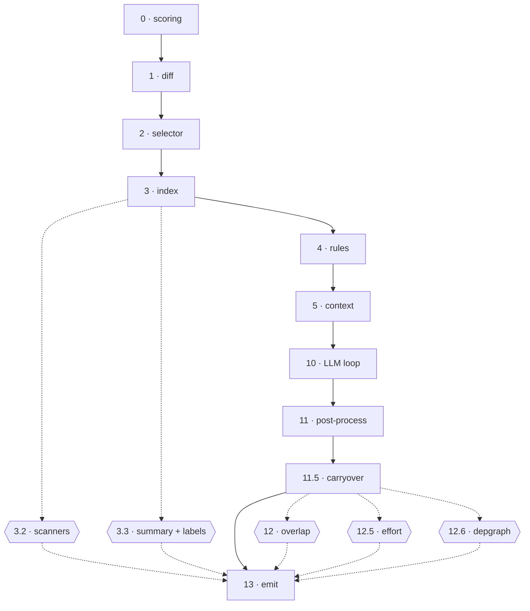

<div align="center">

# sacr

**AI code review that ships with your PRs.**
Deterministic engineering wrapped around a thin agent loop. One Go binary. Real bugs, not noise.

[](https://github.com/shubam-disseqt/shubam-ai-code-reviewer/actions/workflows/ci.yml)
[](https://github.com/shubam-disseqt/shubam-ai-code-reviewer/actions/workflows/govulncheck.yml)
[](LICENSE)
[](go.mod)
[](https://slsa.dev)

**[Website](https://shubam-disseqt.github.io/shubam-ai-code-reviewer/)** · **[Docs](https://shubam-disseqt.github.io/shubam-ai-code-reviewer/docs)** · [Quickstart](#quick-start) · [Architecture](#architecture) · [Integrate](#integrate)

</div>

---

## At a glance

|  |  |
|---|---|
| **Recall** | 21 / 21 seeded bugs caught on the 10-PR audit |
| **Cost** | ~$0.006 per PR at `gpt-4o-mini` |
| **Providers** | Anthropic · OpenAI · AWS Bedrock · DeepSeek |
| **Distribution** | Homebrew · npm · Docker · GitHub Action · direct binary |

---

## Quick start

```bash
brew install shubam-disseqt/tap/sacr
export OPENAI_API_KEY=sk-...
sacr review --pr 42 --format github
```

Every PR gets inline review, effort score, package-imports diagram, and risk labels. Push a fix commit — resolved findings drop, unfixed ones carry, new bugs surface. Full flags: [CLI docs](https://shubam-disseqt.github.io/shubam-ai-code-reviewer/docs/reference/cli).

---

## Features

- **Inline comments** on the exact lines, batched, line-snapped to real diff positions
- **Summary comment** as `github-actions[bot]` — walkthrough · findings · effort · risk — never edits the PR body
- **Committable suggestions** for extract-helper, guard-clause, error-wrap
- **Structured labels** — `pr_type` · `domains` · `risk_tag` · `ownership_hints`
- **Effort score 0–10** with an audit table whose rows sum to the shown value
- **Package-imports diagram** — every edge is a literal `import` line
- **Deterministic scanners** — `gitleaks` · `semgrep` · `govulncheck` (reachability-filtered)
- **SARIF 2.1.0** for GitHub Code Scanning with alert-state tracking
- **Two-tier LLM routing** — strong model reviews, cheap model summarises + labels
- **Cross-PR overlap** — Jaccard prefilter, LLM verdict only on survivors
- **Fingerprint carryover** — resolved drop, unfixed carry, new surface
- **Persistent index + JIT fallback** — `sacr index` builds SQLite; reviewer falls back to on-demand reads
- **Org-level rules** — YAML in a git repo, scope-filtered, prompt-injected
- **Session log** — JSONL audit trail at `~/.sacr/sessions/<uuid>.jsonl`

---

## Architecture



Two layers, different guarantees. The **deterministic path** — scanners, scoring, fingerprints, effort, depgraph, overlap — is pure Go: same input → same output. The **LLM path** handles only the judgement calls the deterministic side cannot make.

### 13-stage pipeline



**Fatal** (abort): diff, scoring, session, LLM, prompts, tools, emit.
**Fault-tolerant** (warn + continue): scanners, cheap-tier agents, index, overlap, effort, depgraph.

Full package map: [architecture docs](https://shubam-disseqt.github.io/shubam-ai-code-reviewer/docs/architecture/pipeline).

---

## Integrate

### GitHub Action

```yaml
- uses: shubam-disseqt/shubam-ai-code-reviewer@v1
  with:
    pr-number: ${{ github.event.pull_request.number }}
    api-key: ${{ secrets.OPENAI_API_KEY }}
    github-token: ${{ secrets.GITHUB_TOKEN }}
```

### Docker

```bash
docker run --rm -v "$PWD":/repo \
  -e OPENAI_API_KEY -e GITHUB_TOKEN \
  ghcr.io/shubam-disseqt/sacr:latest \
  review --pr 42 --format github
```

Homebrew · npm · direct binary: [installation docs](https://shubam-disseqt.github.io/shubam-ai-code-reviewer/docs/getting-started/installation).

---

## Providers

| Provider | Auth | Models |
|---|---|---|
| Anthropic | `ANTHROPIC_API_KEY` | Sonnet 4.6 · Opus 4.7 · Haiku 4.5 |
| OpenAI | `OPENAI_API_KEY` | GPT-4o · GPT-4o-mini · o1 · o3-mini |
| AWS Bedrock | ambient AWS chain | Claude via Bedrock |
| DeepSeek | `DEEPSEEK_API_KEY` | `deepseek-chat` · `deepseek-reasoner` |

Full setup: [providers docs](https://shubam-disseqt.github.io/shubam-ai-code-reviewer/docs/reference/providers).

---

## Compared to alternatives

|  | sacr | CodeRabbit | Greptile | Ellipsis |
|---|---|---|---|---|
| Deployment | Single binary | SaaS | SaaS | SaaS |
| Cost per PR | ~$0.006 | $8–15 flat | $12/user/mo | $20/user/mo |
| Deterministic scoring | Yes | No | No | No |
| Depgraph from real imports | Yes | No | No | No |
| Choice of LLM provider | 4 providers | Vendor-locked | Vendor-locked | Vendor-locked |
| Local-only mode | Yes | No | No | No |
| Custom scoring policy | YAML | No | No | No |

sacr trades polish for control: bring your own model, own the data, verify every claim.

---

## Contributing

```bash
git clone git@github.com:shubam-disseqt/shubam-ai-code-reviewer.git
go build ./cmd/sacr
go test ./...
```

Rules for AI-assisted PRs: [`AGENTS.md`](AGENTS.md). Roadmap: [`ROADMAP.md`](ROADMAP.md).

---

<div align="center">

**Apache-2.0** · [Website](https://shubam-disseqt.github.io/shubam-ai-code-reviewer/) · [Docs](https://shubam-disseqt.github.io/shubam-ai-code-reviewer/docs) · [Issues](https://github.com/shubam-disseqt/shubam-ai-code-reviewer/issues) · [Discussions](https://github.com/shubam-disseqt/shubam-ai-code-reviewer/discussions)

</div>
