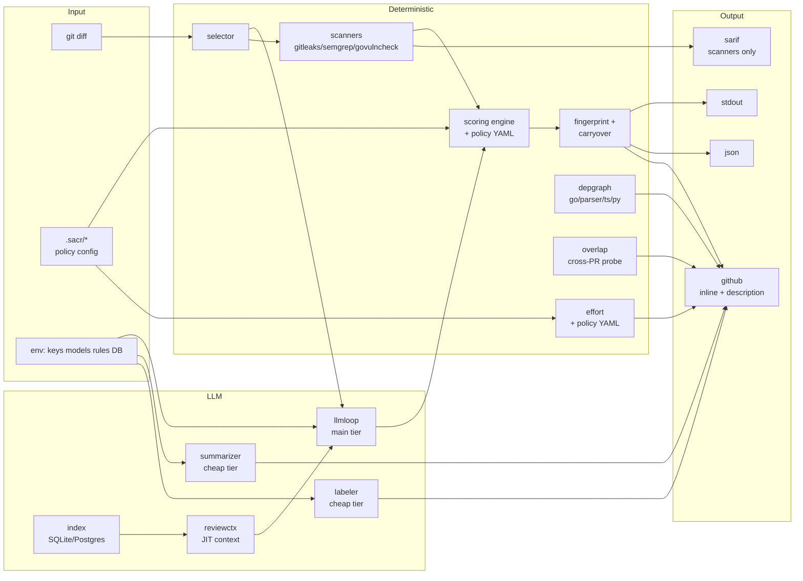
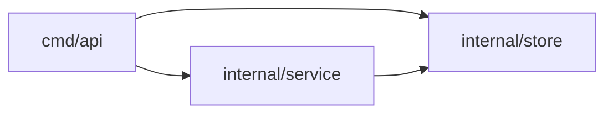

<div align="center">

# sacr

**AI code review that ships with your PRs.**
Deterministic engineering wrapped around a thin agent loop. One binary. Real bugs, not noise.

[](https://github.com/shubam-disseqt/shubam-ai-code-reviewer/actions/workflows/ci.yml)
[](https://github.com/shubam-disseqt/shubam-ai-code-reviewer/actions/workflows/govulncheck.yml)
[](LICENSE)
[](go.mod)
[](https://slsa.dev)

[Quick start](#quick-start) · [Architecture](#architecture) · [Docs](https://shubam-disseqt.github.io/shubam-ai-code-reviewer/) · [Roadmap](ROADMAP.md)

</div>

---

## At a glance

|  |  |
|---|---|
| **Recall** | 21 / 21 seeded bugs caught on the 10-PR audit (100%) |
| **Precision** | ~1 false positive per 10 findings |
| **Cost** | ~$0.006 per PR at `gpt-4o-mini`; $220/year at 100 PRs/day |
| **Latency** | Median 20–30 s per PR; 150 s on a 40-file mega PR |
| **Providers** | Anthropic · OpenAI · AWS Bedrock · DeepSeek |
| **Languages** | Go · TypeScript · Python · Ruby · JavaScript |
| **Platforms** | Linux · macOS · Windows |
| **Distribution** | Homebrew · npm · Docker · GitHub Action · direct binary |

---

## Quick start

```bash
# 1. Install
brew install shubam-disseqt/tap/sacr      # or: npm i -g sacr

# 2. Configure the LLM
export OPENAI_API_KEY=sk-...
export SACR_MODEL=gpt-4o-mini             # or claude-sonnet-4-6

# 3. Review a diff
sacr review                               # workspace diff (uncommitted)
sacr review --from main --to feature/x    # branch range
sacr review --commit abc123               # single commit

# 4. Post to a GitHub PR
export GITHUB_TOKEN=ghp_...
export GITHUB_REPOSITORY=owner/repo
sacr review --pr 42 --format github
```

### GitHub Actions

```yaml
- uses: shubam-disseqt/shubam-ai-code-reviewer@v1
  with:
    pr-number: ${{ github.event.pull_request.number }}
    api-key: ${{ secrets.OPENAI_API_KEY }}
    github-token: ${{ secrets.GITHUB_TOKEN }}
```

Three lines. Every PR gets an inline review with effort score, findings, and a package-imports diagram.

---

## What it does

Every `sacr review` produces:

1. **Inline PR comments** on the exact lines with real bugs, tagged by severity + category
2. **A managed PR description block** with the walkthrough, findings table, and risk assessment
3. **A reviewer-effort score (0-10)** with a full audit table showing every contribution
4. **A package-imports Mermaid diagram** parsed from real `import` lines (Go, TypeScript, Python)
5. **Cross-PR overlap warnings** when the diff collides with other open PRs
6. **Committable suggestion blocks** for extract-helper, guard-clause, and error-wrap opportunities
7. **SARIF output** for GitHub Code Scanning (gitleaks / semgrep / govulncheck findings)
8. **Structured labels** (pr_type, domains, risk_tag, ownership_hints) with stale-cleanup

Push a fix commit — the resolved findings drop, unfixed ones carry, new bugs surface. No stale comments, no re-run noise.

---

## Architecture



**Two layers with different guarantees:**

- **Deterministic path** — scanners, scoring, fingerprints, effort, depgraph, overlap. All Go. Same input → same output every run. Reproducible, auditable, cheap.
- **LLM path** — main-tier reviewer per file, plus cheap-tier summarizer + labeler in parallel. Judgement calls the deterministic path can't make.

The LLM sees each file's diff and a small set of read/search tools; it emits `code_comment` or `task_done`. That's it. No agent chains, no reasoning loops, no LangGraph.

---

## Design principles

| Axis | Choice | Why |
|---|---|---|
| **Determinism** | Deterministic engineering wraps a thin LLM loop | Scanners, scoring, math, dedup all Go — LLM only for judgement |
| **Auditability** | Every claim in the PR body is verifiable | Effort table rows sum to shown score; depgraph edges = literal imports |
| **Cost** | Two-tier model routing | Main tier for review; cheap tier for summarizer/labeler; ~30-40% saved |
| **Idempotency** | Content-hash fingerprints | Fix commit → resolved findings drop cleanly; no re-run noise |
| **Distribution** | Single Go binary | No Python runtime, no LangChain, no service to deploy |
| **Composability** | Four output formats | stdout, JSON, GitHub, SARIF — pick what your pipeline consumes |

---

## Review pipeline

`runReview()` runs 13 numbered stages. Every stage wraps its error with a `stage:` prefix so a failure names the phase.

```mermaid
flowchart TD
    P0["0 · Load scoring +<br/>zconfig policy"]
    P1["1 · Resolve diff<br/>--from/--to / --commit / workspace"]
    P15["1.5 · No-reviewable-changes<br/>early return docs/deps PRs"]
    P2["2 · Selector<br/>drop binary/deleted/large"]
    P25["2.5 · Same as 1.5 if all filtered"]
    P3["3 · Index store<br/>optional SQLite"]
    P32["3.2 · Deterministic scanners<br/>gitleaks / semgrep / govulncheck"]
    P33["3.3 · Cheap-tier agents<br/>summarizer + labeler parallel"]
    P4["4 · Org rules load"]
    P5["5 · Repo context<br/>indexed OR JIT"]
    P6["6 · Session start<br/>or resume"]
    P7["7 · LLM tier resolve"]
    P8["8 · Prompts + tools load"]
    P9["9 · Tool registry"]
    P10["10 · LLM loop<br/>per file, tool-driven"]
    P11["11 · Post-process<br/>score, filter, dedup"]
    P115["11.5 · Carryover<br/>new/carried/resolved"]
    P12["12 · Overlap detect"]
    P125["12.5 · Effort score 0-10"]
    P126["12.6 · Depgraph render"]
    P13["13 · Emit<br/>stdout/json/github/sarif"]

    P0 --> P1 --> P15 --> P2 --> P25 --> P3 --> P32 --> P33 --> P4 --> P5 --> P6 --> P7 --> P8 --> P9 --> P10 --> P11 --> P115 --> P12 --> P125 --> P126 --> P13
```



**Fault-tolerant stages** (log warning, continue with empty result): scanners, cheap-tier agents, index, overlap, effort, depgraph.
**Fatal stages** (abort with wrapped error): diff, scoring, session, LLM, prompts, tools, emit.

---

## Compared to alternatives

|  | sacr | CodeRabbit | Greptile | Ellipsis |
|---|---|---|---|---|
| Deployment model | Single binary | SaaS | SaaS | SaaS |
| Cost per PR | ~$0.006 | $8-15 (unlimited) | $12/user/mo | $20/user/mo |
| Deterministic scoring engine | Yes | No | No | No |
| Auditable effort math | Yes | No | No | No |
| Depgraph from real imports | Yes | No | No | No |
| Cross-PR overlap detection | Yes | Partial | No | No |
| Local-only mode (no cloud) | Yes | No | No | No |
| Choice of LLM provider | 4 providers | Vendor-locked | Vendor-locked | Vendor-locked |
| Custom scoring policy | YAML | No | No | No |

sacr trades polish (no web dashboard, no chat interface) for **control** (bring your own model, own the data, verify every claim).

---

## Features

### Effort scoring
Every review produces a **0-10 reviewer-effort score** with a full audit table showing every contribution.

```
### Reviewer effort — 🟡 5 / 10 — medium

| Signal              | Detail                    | Contribution |
| Base                |                           | +0.50        |
| LOC churn           | +28 / −0 (28 lines)       | +0.14        |
| Files changed       | 1 file                    | +0.05        |
| New files           | 1 new                     | +0.10        |
| Auth path touched   | internal/auth/session.go  | +1.50        |
| Findings            | 1 CRIT / 5 HIGH           | +4.00 (cap)  |
```

Deterministic — same diff + same policy → same score. Override the policy via `.sacr/effort.yaml`.

| Score | Label | Dot |
|---|---|---|
| 0-2 | trivial | 🟢 |
| 3-4 | light | 🟢 |
| 5-6 | medium | 🟡 |
| 7-8 | medium-high | 🟡 |
| 9-10 | heavy | 🔴 |

### Suggestion mode
Committable improvement suggestions delivered as GitHub `suggestion` markdown blocks. Reviewers click **Commit suggestion** to apply — zero custom UI.

````
**[nit]** **[low / style]** Early returns keep the happy path un-indented.

```suggestion
if user == nil {
    return errNilUser
}
if !user.Active {
    return errInactive
}
return process(user)
```
````

**Categories:** extract helper · guard-clause conversion · error wrapping · idiomatic Go · naming · missing tests · missing docs.

Caps: 5 per file, 20 per PR. Toggle via `.sacr/config.yaml`:

```yaml
suggestions:
  enabled: true      # default
  blocking: false    # default — never break CI
```

### Depgraph
Every PR with ≥2 packages that import each other gets a Mermaid diagram of the real import graph. Parsed by `go/parser` (Go), regex (TypeScript, Python) — **every edge is a literal `import` line**, no LLM guessing.



### Overlap detection
When multiple open PRs touch the same files, sacr surfaces the collision:

```
> Potential overlap with other open PRs:
> - #9 (merge-conflict risk) — Both PRs modify internal/legacy/*
> - #3 (merge-conflict risk) — Both PRs modify auth middleware
```

Contributes up to `+1.5` to the effort score. Disable with `SACR_OVERLAP_ENABLED=0`.

### Deterministic scanners
Best-effort integration with three tools:

| Scanner | What it finds | Routing |
|---|---|---|
| **gitleaks** | Hardcoded secrets, API tokens | SARIF |
| **semgrep** | Pattern-based bugs & security | SARIF (bundled rules for JS / Python / Ruby) |
| **govulncheck** | Known CVEs in Go dependencies | SARIF |

Missing binaries are logged and skipped — never fatal. Bundled semgrep rules ship for JavaScript, Python, and Ruby (36 curated rules). Override with `SACR_SEMGREP_CONFIG=<path>` or disable with `SACR_DISABLE_SEMGREP_PRESETS=1`.

### Incremental re-review
Every finding has a content-hash **fingerprint** stored in `~/.sacr/findings/`. On the next run:

- **Resolved** — finding was in the previous run, not in this one → cleaned up
- **Carried** — finding survives both runs → not re-posted, just tracked
- **New** — finding introduced by the fix commit

Stale sacr-authored comments are identified via a hidden `<!-- sacr:fp:HEX -->` marker in the comment body and deleted before the fresh batch posts. No duplicate spam across pushes.

### Model tiering

| Tier | Purpose | Cost profile |
|---|---|---|
| **Main** (`SACR_MODEL`) | Main task loop + memory compression | Sonnet-class |
| **Cheap** (`SACR_CHEAP_MODEL`) | Summarizer + labeler (parallel) | Haiku / Flash / DeepSeek |

Main tier has session-key affinity for prompt-cache reuse. Setting only `SACR_CHEAP_MODEL` re-uses the main client but overrides the model per call.

---

## Commands

| Command | Purpose |
|---|---|
| `sacr review` | Run the full review pipeline |
| `sacr index` | Build/refresh SQLite code index |
| `sacr overlap` | Detect cross-PR collisions |
| `sacr metrics` | HTML dashboard of past runs (cost, findings, duration) |
| `sacr rules list` | List loaded org rules |
| `sacr rules sync` | Force-refresh org rules |
| `sacr doctor` | Pre-flight environment check (Bedrock, DeepSeek, git, scanners) |
| `sacr docs` | Serve embedded offline docs on loopback |
| `sacr version` | Print version / commit / build info |

**Exit codes:** `0` clean · `1` general error · `3` one or more CRITICAL findings

---

## Configuration

Three layers, decreasing precedence:

**1. CLI flags** — `--from`, `--to`, `--commit`, `--pr`, `--format`, `--output`, `--min-severity`, `--resume`, `--verbose`, `--wait-sarif`.

**2. Environment variables** (essentials):

```bash
# LLM auth (pick one)
export ANTHROPIC_API_KEY=sk-ant-...
export OPENAI_API_KEY=sk-...
export DEEPSEEK_API_KEY=sk-...
export AWS_REGION=us-east-1                    # + AWS_PROFILE for Bedrock

# Model routing
export SACR_PROVIDER=openai                    # anthropic | openai | bedrock | deepseek
export SACR_MODEL=gpt-4o-mini
export SACR_CHEAP_MODEL=deepseek-chat          # optional, saves ~30-40%

# GitHub integration
export GITHUB_TOKEN=ghp_...
export GITHUB_REPOSITORY=owner/repo

# Storage
export SACR_DB_URL=sqlite:///~/.sacr/index.db   # optional index cache

# Feature gates
export SACR_UPLOAD_SARIF=1                     # publish scanner findings to Code Scanning
export SACR_OVERLAP_ENABLED=0                  # disable cross-PR probe
export SACR_LOG_FORMAT=json                    # structured logs
```

**3. Repo-local YAML** under `<repo>/.sacr/`:

| File | Purpose |
|---|---|
| `config.yaml` | Toggle suggestions on/off, gate CI on nits |
| `scoring.yaml` | Per-repo scoring policy override |
| `effort.yaml` | Per-repo effort weights override |

Missing or malformed files log a warning and fall back to embedded defaults.

Full env-var list: [`docs/configuration.html`](docs/configuration.html)

---

## Output formats

| Format | Use case | Destination |
|---|---|---|
| `stdout` | Local diagnosis | Terminal (ANSI-colored) |
| `json` | CI / dashboards | File or stdout |
| `github` | PR review | Inline comments + description block + labels |
| `sarif` | GitHub Code Scanning | File; upload via `SACR_UPLOAD_SARIF=1` |

The `github` format posts inline comments batched via `POST /pulls/{n}/reviews` (avoids per-comment secondary rate limits), identifies stale sacr comments by fingerprint marker and deletes them before posting the fresh set, and updates the PR description in-place using `<!-- SACR:BEGIN -->` / `<!-- SACR:END -->` markers.

---

## LLM loop

The main-task loop runs one review per file. Each iteration:

1. Send the conversation to the model (prefix extension for cache reuse)
2. Parse tool calls; if none for 3 rounds in a row → stop
3. Execute each tool call
4. Compression: 60% context → async background; 80% → sync emergency
5. Repeat until `task_done`, budget exhaustion, or context cancelled

**Tools available:**

| Tool | Purpose |
|---|---|
| `code_comment` | Emit a finding (severity, category, content, optional `suggestion_code`) |
| `task_done` | Signal completion (DONE or FAILED) |
| `code_search` | Regex/literal search across the repo; capped at 100 hits |
| `file_read` | Read a file with optional line range; capped at 500 lines |
| `file_read_diff` | View unified diffs for one or more paths |
| `file_find` | Find files by name/pattern |

**Budgets:** 100 rounds per file · 3 consecutive empty rounds → stop · 80% context = hard stop · grace round with just `code_comment` + `task_done` if budget exhausted.

---

## Package layout

34 internal packages, all tested. Organized by concern:

| Layer | Packages |
|---|---|
| **Data** | `filetype`, `model`, `filter`, `pathutil` |
| **Diff & git** | `diff`, `gitcmd`, `rules` |
| **LLM** | `llm`, `llmloop`, `index`, `tool`, `prompts` |
| **Context** | `reviewctx`, `index` |
| **Rules & config** | `rules`, `zconfig`, `scoring`, `effort` |
| **Findings** | `comment`, `fingerprint`, `findings`, `scanner`, `chunker` |
| **Output** | `gh`, `sarif`, `session`, `depgraph`, `overlap` |
| **Utilities** | `conventions`, `docsserver`, `extract`, `logutil`, `manifests`, `selector` |

Full package map with purpose and key exports: [`docs/architecture.html`](docs/architecture.html)

---

## Audit results

10-PR + 1 mega-PR audit (Sep 2026, `gpt-4o-mini`):

|  | Result |
|---|---|
| Bugs seeded / caught | 21 / 21 → **100% recall** |
| False positives | ~1 per 10 findings |
| Loop closure (fix → resolved) | 4 / 4 PRs cleanly closed |
| Effort table sum vs shown score | exact (or correctly clamped at 10) |
| Depgraph edge honesty | 100% — every edge maps to literal `import` |
| Score directionality on fix | always drops |
| Total cost across 22 runs | ~$0.09 |

Verified per archetype: trivial docs · small clean feat · small bug-heavy · cross-pkg refactor (depgraph) · auth-touching · migration · test-heavy · large clean feat · large bug-heavy · deps update.

Detailed audit: [`docs/AUDIT.md`](docs/) (post-v1)

---

## Providers

| Provider | Auth | Notes |
|---|---|---|
| **Anthropic** | `ANTHROPIC_API_KEY` | Claude Sonnet 4.6 / Opus 4.7 / Haiku 4.5 |
| **OpenAI** | `OPENAI_API_KEY` | GPT-4o, GPT-4o-mini, o1, o3-mini |
| **OpenAI Responses** | `OPENAI_RESPONSES_API_KEY` | For Responses API endpoints |
| **AWS Bedrock** | `AWS_REGION` + `AWS_PROFILE` / SSO / IAM role | Claude via Bedrock — ambient AWS credential chain |
| **DeepSeek** | `DEEPSEEK_API_KEY` | Low-cost cheap-tier option (`deepseek-chat`, `deepseek-reasoner`) |

**Recommended pairings:**

- **Best quality** — Sonnet 4.6 (main) + Haiku 4.5 (cheap)
- **Best cost** — GPT-4o-mini (main) + DeepSeek-chat (cheap)
- **Best balance** — Sonnet 4.6 (main) + GPT-4o-mini (cheap)

Manual provider-testing protocols: [`docs/PROVIDER_TESTING.md`](docs/PROVIDER_TESTING.md)

---

## Development

```bash
# Clone
git clone git@github.com:shubam-disseqt/shubam-ai-code-reviewer.git
cd shubam-ai-code-reviewer

# Build
go build ./cmd/sacr

# Test — 34 packages, all covered
go test ./...
go test -race ./...

# Dogfood
./sacr review --from main --to HEAD
```

**Contributing:** read [`AGENTS.md`](AGENTS.md) for rules on AI-assisted PRs.

**Project layout:**

```
cmd/sacr/              CLI entry + pipeline glue
internal/              34 focused packages
docs/                  Offline HTML docs (embedded)
  THREAT_MODEL.md      Attack surface + mitigations
  ARCHITECTURE.md      Long-form architectural walkthrough
  BENCHMARK_PLAN.md    Sonnet 4.6 evaluation plan
  PROVIDER_TESTING.md  Manual test protocols for Bedrock & DeepSeek
  WINDOWS.md           Platform-specific setup + gotchas
  DOCKER.md            Container distribution
  GITHUB_ACTION.md     Reusable Action integration
ide/vscode/            VS Code extension skeleton
marketing/site/        Landing page
packaging/             Homebrew formula + npm wrapper
ROADMAP.md             Phase-by-phase status
AGENTS.md              Rules for AI-assisted contributions
```

---


<div align="center">

**Apache-2.0** · [Documentation](https://shubam-disseqt.github.io/shubam-ai-code-reviewer/) · [Issues](https://github.com/shubam-disseqt/shubam-ai-code-reviewer/issues) · [Discussions](https://github.com/shubam-disseqt/shubam-ai-code-reviewer/discussions)

</div>
