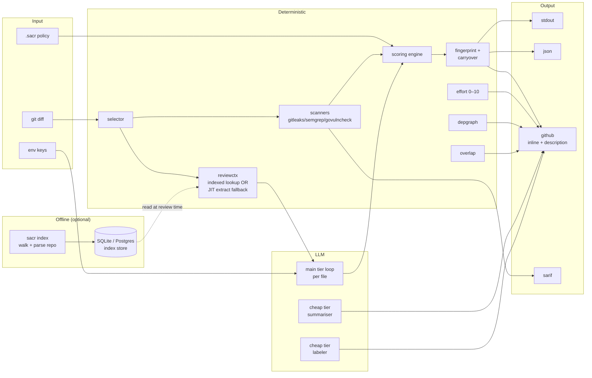

<div align="center">

# sacr

**AI code review that ships with your PRs.**
Deterministic engineering wrapped around a thin agent loop. One Go binary. Real bugs, not noise.

[](https://github.com/shubam-disseqt/shubam-ai-code-reviewer/actions/workflows/ci.yml)
[](https://github.com/shubam-disseqt/shubam-ai-code-reviewer/actions/workflows/govulncheck.yml)
[](LICENSE)
[](go.mod)
[](https://slsa.dev)

**[Website](https://shubam-disseqt.github.io/shubam-ai-code-reviewer/)** · **[Docs](https://shubam-disseqt.github.io/shubam-ai-code-reviewer/docs)** · [Quickstart](#quick-start) · [Architecture](#architecture) · [Integrate](#integrate) · [Roadmap](ROADMAP.md)

**See sacr in action on a real PR:** [20 files / 5 seeded bugs](https://github.com/shubam-disseqt/zreview-e2e-matrix/pull/14) · [single SQL-injection bug](https://github.com/shubam-disseqt/zreview-e2e-matrix/pull/13)

</div>

---

## At a glance

|  |  |
|---|---|
| **Recall** | 21 / 21 seeded bugs caught on the 10-PR audit (100%) |
| **Precision** | ~1 false positive per 10 findings |
| **Cost** | ~$0.006 per PR at `gpt-4o-mini` · ~$220/year at 100 PRs/day |
| **Latency** | Median 20–30 s per PR · 150 s on a 40-file mega PR |
| **Providers** | Anthropic · OpenAI · AWS Bedrock · DeepSeek |
| **Languages** | Go · TypeScript · Python · Ruby · JavaScript |
| **Platforms** | Linux · macOS · Windows |
| **Distribution** | Homebrew · npm · Docker · GitHub Action · direct binary |

---

## Quick start

```bash
# 1. Install
brew install shubam-disseqt/tap/sacr      # or: npm i -g sacr

# 2. Configure the LLM
export OPENAI_API_KEY=sk-...
export SACR_MODEL=gpt-4o-mini             # or claude-sonnet-4-6

# 3. Review a diff
sacr review                               # workspace diff (uncommitted)
sacr review --from main --to feature/x    # branch range
sacr review --commit abc123               # single commit

# 4. Post to a GitHub PR
export GITHUB_TOKEN=ghp_...
export GITHUB_REPOSITORY=owner/repo
sacr review --pr 42 --format github
```

Three lines. Every PR gets inline review, effort score, and a real
import-graph diagram. Push a fix commit — resolved findings drop, unfixed
ones carry, new bugs surface. No stale spam.

---

## What it does

Every `sacr review` produces the same set of artefacts — no configuration
required:

1. **Inline PR comments** on the exact lines with real bugs, batched via a single review call to avoid GitHub secondary rate limits
2. **A managed PR description** with the walkthrough, findings table, and risk assessment, updated in-place via hidden markers
3. **A reviewer-effort score (0–10)** with a full audit table where every row sums to the shown value — no vibes
4. **A package-imports Mermaid diagram** parsed by `go/parser` (Go) and regex (TypeScript, Python). Every edge is a literal import line
5. **Cross-PR overlap warnings** when your diff collides with another open PR (merge-conflict risk + owner-of-record probe)
6. **Committable suggestion blocks** for extract-helper, guard-clause, and error-wrap opportunities — reviewers click **Commit suggestion** to apply
7. **SARIF 2.1.0 output** for GitHub Code Scanning (gitleaks, semgrep, govulncheck findings appear in the Security tab)
8. **Structured labels** (`pr_type`, `domains`, `risk_tag`, `ownership_hints`) with stale-cleanup on re-run

---

## Design principles

Five choices that keep the tool honest. Full walkthrough in the
[architecture docs](https://shubam-disseqt.github.io/shubam-ai-code-reviewer/docs/architecture).

| Axis | Choice | Why |
|---|---|---|
| **Determinism** | Deterministic engineering wraps a thin LLM loop | Scanners, scoring, math, dedup all in Go — LLM only for judgement |
| **Auditability** | Every claim in the PR body is verifiable | Effort table rows sum to shown score; depgraph edges = literal imports |
| **Cost** | Two-tier model routing | Main tier for review; cheap tier for summariser and labeler; ~30–40% saved |
| **Idempotency** | Content-hash fingerprints | Fix commit → resolved findings drop cleanly; no re-run noise |
| **Distribution** | Single Go binary | No Python runtime, no LangChain, no service to deploy |

---

## Architecture



**Two layers with different guarantees:**

- **Deterministic path** — scanners, scoring, fingerprints, effort, depgraph, overlap. All Go. Same input → same output every run. Reproducible, auditable, cheap.
- **LLM path** — main-tier reviewer per file, plus cheap-tier summariser + labeler in parallel. Judgement calls the deterministic path cannot make.

The LLM sees each file's diff and a small set of read/search tools; it emits
`code_comment` or `task_done`. That's it — no agent chains, no reasoning
loops, no LangGraph.

Full 13-stage pipeline + package map:
[architecture docs](https://shubam-disseqt.github.io/shubam-ai-code-reviewer/docs/architecture/pipeline).

---

## Integrate

One binary, five distribution channels. Pick the one that already lives in
your pipeline.

### GitHub Action *(most common)*

```yaml
- uses: shubam-disseqt/shubam-ai-code-reviewer@v1
  with:
    pr-number: ${{ github.event.pull_request.number }}
    api-key: ${{ secrets.OPENAI_API_KEY }}
    github-token: ${{ secrets.GITHUB_TOKEN }}
```

### Homebrew

```bash
brew install shubam-disseqt/tap/sacr
sacr doctor                   # pre-flight environment check
sacr review --from main --to HEAD
```

### npm

```bash
npm i -g sacr
sacr review --pr 42 --format github
```

### Docker

```bash
docker run --rm -v "$PWD":/repo \
  -e OPENAI_API_KEY -e GITHUB_TOKEN \
  ghcr.io/shubam-disseqt/sacr:latest \
  review --pr 42 --format github
```

### Direct binary

Download from [releases](https://github.com/shubam-disseqt/shubam-ai-code-reviewer/releases) — Linux, macOS, Windows amd64/arm64. Verify via SLSA build provenance.

### VS Code

Extension skeleton lives in [`ide/vscode/`](ide/vscode/) — surfaces `sacr review` output in the Problems panel and diff gutters.

---

## Providers

| Provider | Auth | Notes |
|---|---|---|
| **Anthropic** | `ANTHROPIC_API_KEY` | Claude Sonnet 4.6 / Opus 4.7 / Haiku 4.5 |
| **OpenAI** | `OPENAI_API_KEY` | GPT-4o, GPT-4o-mini, o1, o3-mini |
| **OpenAI Responses** | `OPENAI_RESPONSES_API_KEY` | For Responses API endpoints |
| **AWS Bedrock** | `AWS_REGION` + `AWS_PROFILE` / SSO / IAM role | Claude via Bedrock — ambient AWS credential chain |
| **DeepSeek** | `DEEPSEEK_API_KEY` | Low-cost cheap-tier option (`deepseek-chat`, `deepseek-reasoner`) |

**Recommended pairings:**

- **Best quality** — Sonnet 4.6 (main) + Haiku 4.5 (cheap)
- **Best cost** — GPT-4o-mini (main) + DeepSeek-chat (cheap)
- **Best balance** — Sonnet 4.6 (main) + GPT-4o-mini (cheap)

Full provider setup: [providers docs](https://shubam-disseqt.github.io/shubam-ai-code-reviewer/docs/reference/providers).

---

## Data ownership

There is no hosted sacr service. Every review runs in the same process that reads your diff.

- **Your diff goes only to the LLM provider you configured.** sacr calls the provider's API directly with your key; the response is consumed in-process and never proxied through third-party infrastructure.
- **No server, no dashboard, no telemetry.** Nothing to opt out of because nothing collects.
- **The index stays local.** `sacr index` builds an SQLite (or your own Postgres) store on your infrastructure. It's read at review time by the reviewer running in the same process; it never phones home.
- **Session logs stay local.** `~/.sacr/sessions/<uuid>.jsonl` is the full audit trail — LLM requests, responses, tool calls, findings — written to disk on the machine that ran the review.
- **CI credentials, not sacr credentials.** The GitHub token used to post comments is your workflow's `GITHUB_TOKEN` (or a PAT you provide). sacr does not require you to install an app or share write access with a third party.

Bring your own model. Own the data. Verify every claim.

---

## Configuration

Three layers, decreasing precedence:

1. **CLI flags** — `--from`, `--to`, `--commit`, `--pr`, `--format`, `--output`, `--min-severity`, `--resume`, `--verbose`
2. **Environment variables** — LLM auth, model routing, GitHub integration, feature gates ([full list](https://shubam-disseqt.github.io/shubam-ai-code-reviewer/docs/reference/configuration))
3. **Repo-local YAML** under `.sacr/` — `config.yaml` (suggestions on/off), `scoring.yaml` (severity policy override), `effort.yaml` (effort weights override)

Missing or malformed config falls back to embedded defaults.

---

## Output formats

| Format | Use case | Destination |
|---|---|---|
| `stdout` | Local diagnosis | Terminal (ANSI-colored) |
| `json` | CI / dashboards | File or stdout |
| `github` | PR review | Inline comments + description block + labels |
| `sarif` | GitHub Code Scanning | File; upload via `SACR_UPLOAD_SARIF=1` |

---

## See it in action

Every sacr release runs against a persistent set of test PRs on the [`zreview-e2e-matrix`](https://github.com/shubam-disseqt/zreview-e2e-matrix) repo. Each PR is a live audit trail of what sacr sees, what it comments, and how much it costs.

| PR | Shape | What sacr does |
|---|---|---|
| [#13 — SQL injection in a Go http handler](https://github.com/shubam-disseqt/zreview-e2e-matrix/pull/13) | 1 file, 1 seeded bug | Inline `security/high` comment on the vulnerable line with a parameterized-query suggestion block. `risk/high` label applied. |
| [#14 — 20-file service scaffold](https://github.com/shubam-disseqt/zreview-e2e-matrix/pull/14) | 20 files, 5 seeded bugs (SQLi, hardcoded credential, path traversal, race condition, XSS) | Inline comments on each bug, `effort: 2/10` score, `depgraph` diagram of the changed packages, `risk_tag`, `domains`, `pr_type` labels, ~$0.006 total. |

Open each PR and click the `github-actions[bot]` review — everything visible on the conversation tab is generated by a single `sacr review --pr N --format github` call, without a hosted service.

---

## Compared to alternatives

|  | sacr | CodeRabbit | Greptile | Ellipsis |
|---|---|---|---|---|
| Deployment | Single binary | SaaS | SaaS | SaaS |
| Cost per PR | ~$0.006 | $8–15 (flat) | $12/user/mo | $20/user/mo |
| Deterministic scoring | Yes | No | No | No |
| Auditable effort math | Yes | No | No | No |
| Depgraph from real imports | Yes | No | No | No |
| Cross-PR overlap detection | Yes | Partial | No | No |
| Local-only mode | Yes | No | No | No |
| Choice of LLM provider | 4 providers | Vendor-locked | Vendor-locked | Vendor-locked |
| Custom scoring policy | YAML | No | No | No |

sacr trades polish (no web dashboard, no chat interface) for **control**:
bring your own model, own the data, verify every claim.

---

## Development

```bash
git clone git@github.com:shubam-disseqt/shubam-ai-code-reviewer.git
cd shubam-ai-code-reviewer

go build ./cmd/sacr
go test ./...
go test -race ./...

./sacr review --from main --to HEAD    # dogfood
```

**Contributing:** read [`AGENTS.md`](AGENTS.md) for rules on AI-assisted PRs.

**Project layout:**

```
cmd/sacr/              CLI entry + pipeline glue
internal/              34 focused packages, all tested
docs/                  Offline HTML docs (embedded in the binary)
docs-site/             Fumadocs + Next.js public docs site
ide/vscode/            VS Code extension skeleton
marketing/site/        Editorial landing page (legacy)
packaging/             Homebrew formula + npm wrapper
ROADMAP.md             Phase-by-phase status
AGENTS.md              Rules for AI-assisted contributions
```

Full package map with purpose and key exports:
[architecture docs](https://shubam-disseqt.github.io/shubam-ai-code-reviewer/docs/architecture/pipeline).

---

## Reviewed by sacr

Let PR authors on your repo know reviews are running under sacr. Add this to your README:

```markdown
[](https://github.com/shubam-disseqt/shubam-ai-code-reviewer)
```

Renders as: [](https://github.com/shubam-disseqt/shubam-ai-code-reviewer)

---

<div align="center">

**Apache-2.0** · [Website](https://shubam-disseqt.github.io/shubam-ai-code-reviewer/) · [Documentation](https://shubam-disseqt.github.io/shubam-ai-code-reviewer/docs) · [Issues](https://github.com/shubam-disseqt/shubam-ai-code-reviewer/issues) · [Discussions](https://github.com/shubam-disseqt/shubam-ai-code-reviewer/discussions)

</div>
