# Architecture

This document is the source of truth for how `shubam-ai-code-reviewer` is built.
It uses Mermaid for the data-flow pipeline and ASCII for trust boundaries.

The same content is embedded in the binary — run `sacr docs` to view
it offline.

---

## 1. What we build, in one paragraph

`sacr` is a Go CLI. It takes a git diff (or a range, or a commit),
optionally consults a **persistent code index** for repo-wide context,
optionally consults an **org-level rules repo** for team-specific review
policy, calls an LLM through a **thin agent loop** with a small set of
tools (file read, code search, file find, comment), snaps LLM-produced
comments to real diff lines via a deterministic post-processor, and
optionally scans other open PRs for overlap or merge-conflict risk. The
output is a stream of comments — printed to stdout, emitted as JSON, or
posted to a PR via a `--format github` writer.

There is no long-running server, no dashboard, no webhook receiver, and
no persistent review history. The index and the rules are the only
things that live longer than a single invocation.

---

## 2. Pipeline

```mermaid
flowchart TD
    IX0["sacr index (offline)<br/>walk + parse repo"] --> IX1[(SQLite<br/>index store)]

    A[git diff / range / commit] --> B[deterministic<br/>file selection]
    B --> C[bundle<br/>related files]
    C --> D["reviewctx<br/>indexed lookup OR<br/>JIT extract fallback"]
    IX1 -. read at review time .-> D
    D --> E[load matching<br/>org rules]

    E --> S1[cheap tier:<br/>summarizer]
    E --> S2[cheap tier:<br/>labeler]
    E --> S3[deterministic scanners:<br/>gitleaks + semgrep + govulncheck]
    E --> F[main tier: LLM agent loop<br/>tools: file_read, code_search,<br/>file_find, file_read_diff,<br/>code_comment, task_done]

    F --> G[comment collector]
    S3 --> G
    G --> H[line-snap<br/>positioning]
    H --> I[reflection<br/>dedup, low-confidence filter]
    I --> P[fingerprint<br/>vs previous findings]
    P --> Q[scoring engine<br/>confidence × impact × category]
    Q --> J[format<br/>stdout &#124; json &#124; github &#124; sarif]
    S1 -.-> J
    S2 -.-> J

    K[open PRs list] -.-> L[fingerprint<br/>prefilter Jaccard]
    L -.-> M[LLM overlap<br/>verdict]
    M -.-> J
```



Dashed edges are best-effort sub-pipelines: cross-PR overlap, PR
summary, and PR labeling all run in parallel with the main review and
never block it — every failure returns an empty result rather than
failing the run.

**Cost-shape.** The main tier (Sonnet-class) runs the reviewer loop
only. Summary + labeler use the cheap tier (Haiku / Flash / DeepSeek).
Scanners are pure Go subprocess wrappers with zero LLM tokens. On a
re-review push, fingerprint carry-over drops files whose findings are
already resolved; the reviewer skips them entirely.

---

## 3. Package map

Not yet all built. Each row lists the target package, its job, and the
source of the approach.

| Package | Job |
|---|---|
| `cmd/sacr` | Cobra CLI: `review`, `scan`, `docs`, `version`, `config`, `llm`, `rules` |
| `internal/diff` | Unified-diff parser, hunk resolution, gitignore, workspace file guard |
| `internal/gitcmd` | Bounded-concurrency git subprocess runner, `--end-of-options` safe |
| `internal/pathutil` | `CanonicalPath`, `WithinBase` (symlink + escape guards) |
| `internal/select` | Deterministic file selection (binary/ext/size gates, no silent skips) |
| `internal/bundle` | Related-file bundling into isolated review units (v2 — v1 is one-file-per-review) |
| `internal/comment` | Comment parsing, `existing_code` line snapping, arg repair, reflection/dedup |
| `internal/llm` | Provider abstraction — Anthropic / OpenAI / Bedrock / Gemini / DeepSeek |
| `internal/llmloop` | Thin agent loop, compression, comment worker pool |
| `internal/tool` | Tool schema + `file_read`, `code_search`, `file_find`, `code_comment`, `task_done` |
| `internal/index` | Repo index writer: file summaries + symbols + imports + external refs |
| `internal/index/store` | Store interface + SQLite backend (`modernc.org/sqlite`); `postgres://` DSNs are rejected explicitly |
| `internal/context` | JIT context (index-miss path) + review-time context join (index-hit path) |
| `internal/manifests` | Deterministic package-manifest parsers: `go.mod`, `package.json`, `pyproject.toml`, `Dockerfile`, `composer.json`, lockfiles. Uses Go-native libs where they exist (`x/mod/modfile`) |
| `internal/extract` | Language-aware symbol/import extractors (regex + brace/indent walkers) |
| `internal/conventions` | Pull `AGENTS.md` / `CONTRIBUTING.md` etc., strip boilerplate, cap 8K chars |
| `internal/rules` | Git-cloned org rules repo → YAML load → glob-scoped filter → prompt injection. YAML-in-git is the storage contract |
| `internal/overlap` | Cross-PR fingerprinting, Jaccard prefilter, batched LLM verdict, tolerant JSON parse |
| `internal/gh` | GitHub REST via `google/go-github`: list open PRs, get PR files, post review comments |
| `internal/session` | JSONL append log for `--resume`, chained by `parentUuid` |
| `internal/docs` | Embedded static docs + local HTTP server for `sacr docs` |
| `internal/prompts` | Embedded prompt templates (`main_task_system.md`, `main_task_user.md`, `memory_compression_task.md`, `summarize.md`, `overlap.md`, `summarizer.md`, `labeler.md`) |
| `internal/fingerprint` | Stable finding hash: `owner\|repo\|category\|normalized_path\|symbol\|normalized_snippet`. Whitespace-collapsed and comment-stripped so pure formatting diffs don't reset findings |
| `internal/findings` | Per-PR JSON persistence keyed by `(owner, repo, pr, fingerprint)`; drives the `fixed / unchanged / affected` re-review split. Atomic write via tmp+rename |
| `internal/scanner` | Deterministic security scanner adapters: Gitleaks (secrets), Semgrep (SAST), govulncheck (Go stdlib CVE). Concurrent runner with best-effort skip when a binary is missing |
| `internal/scoring` | Deterministic severity policy: `confidence × impact × category → CRITICAL / HIGH / MEDIUM / LOW / SUPPRESS`. Table-driven YAML, embeddable defaults, overridable via `SACR_SCORING_POLICY` |
| `internal/sarif` | SARIF 2.1.0 encoder for GitHub Code Scanning uploads. Golden-file tested against schema |
| `internal/llm` (tiers) | `Tiers{Main, Cheap}` client + model resolution. `SACR_CHEAP_MODEL` and `SACR_CHEAP_PROVIDER` env vars; cheap falls back to Main when unset |

---

## 4. Deterministic vs LLM boundary

`sacr` is not a pure agent. It is a rigid Go pipeline with an LLM
loop wedged in the middle. Determinism sits on both ends because that
is where the model's failure modes live.

| Step | Owner | Why |
|---|---|---|
| Which files to review | Go | Coverage guaranteed — no "agent skipped 3 files" |
| How to bundle files | Go | Isolated sub-agent contexts; parallelizable; stable on large diffs |
| Which rules match a file | Go (glob against YAML) | More predictable than prompt-injected rules |
| Which model tier serves a call | Go (`internal/llm/tiers`) | Cheap for structured summary / labeling; main for reviewer — measured 60-70% cost cut vs main-only |
| Secret / SAST / CVE detection | Go (`internal/scanner` shells out to Gitleaks / Semgrep / govulncheck) | Deterministic tools have perfect precision on the categories LLMs are worst at |
| Reading a file, searching code | LLM via tools | Dynamic context is where agents earn their keep |
| Writing review comments | LLM (main tier) | Only creative task |
| PR walkthrough / summary | LLM (cheap tier) | Cheap explanatory prose; best-effort, no critical path |
| PR type / risk labels | LLM (cheap tier) | Structured JSON output, single call |
| Line-number positioning | Go post-processor (line-snap against real hunks) | Fixes the classic LLM off-by-N bug |
| Comment reflection / dedup | Go | Filters low-quality comments before they hit the user |
| Finding fingerprint | Go (`internal/fingerprint`) | Stable across whitespace / renames so incremental re-review can carry state |
| Severity scoring | Go (`internal/scoring`) — deterministic YAML policy | Explicit non-agent decision; no reflection loop (CR-bench: reflexion hurts usefulness) |
| Cross-PR overlap prefilter | Go (Jaccard on title, symbol/file intersect) | Cheap gate before any LLM call |
| Cross-PR overlap verdict | LLM (main tier, batched) | Pattern-match on intent only |
| SARIF encoding for GitHub Code Scanning | Go (`internal/sarif`) | Deterministic schema |

---

## 5. Trust boundaries and threats

The threat surface is intentionally small. This is a per-invocation
CLI — no persistent process, no webhook endpoint, no bound port
except when the user explicitly runs `sacr docs`.

```
┌───────────────────────────────────────────────────────────────┐
│  User machine or CI runner (Trusted Zone)                     │
│                                                               │
│  ┌──────────┐    ┌──────────────┐    ┌────────────────────┐   │
│  │ Git repo │───▶│  sacr CLI │───▶│ Local output       │   │
│  │ (diffs)  │    │  (core)      │    │  stdout / json /   │   │
│  └──────────┘    └──┬──────┬────┘    │  session .jsonl    │   │
│                     │      │         └────────────────────┘   │
│                     │      │                                  │
│                     │      └──────▶ ┌────────────────────┐    │
│                     │               │  Docs server       │    │
│                     │               │  (opt-in, loop     │    │
│                     │               │   back only, host  │    │
│                     │               │   allowlist)       │    │
│                     │               └────────────────────┘    │
└─────────────────────┼──────────┼──────────────────────────────┘
                      │          │
              TLS ────┘          └──── TLS
                      │          │
                      ▼          ▼
        ┌─────────────────┐   ┌──────────────────┐   ┌──────────────────┐
        │ LLM provider    │   │ Index database   │   │ Org-rules repo   │
        │ (HTTPS)         │   │ (SQLite)         │   │ (git, HTTPS/SSH) │
        └─────────────────┘   └──────────────────┘   └──────────────────┘
```

### Actors

| Actor | Trust level |
|---|---|
| Local user / CI runner | Trusted — invokes the CLI with full control over configuration |
| LLM provider API | Semi-trusted — responses validated before use, line numbers re-derived server-side |
| Git repository content | Semi-trusted — diffs may contain adversarial content |
| Index database | Semi-trusted — user-owned, but stores LLM-summarized content that may be adversarially crafted |
| Org-rules repository | Trusted — protected by same GitHub access controls as source |
| Network | Untrusted — all outbound traffic uses TLS |
| Web browser (docs viewer) | Untrusted — may attempt DNS rebinding against the local docs server |

### Threat summary

| ID | Threat | Mitigation |
|---|---|---|
| T1 | Command injection via crafted diff content | External process execution restricted to `git`, hardcoded subcommands, `--end-of-options`, no shell interpolation (ported from sacr `internal/gitcmd`) |
| T2 | API key leakage | Keys read from environment variables only; never logged, never written to session JSONL, never transmitted beyond the configured endpoint |
| T3 | Path traversal via LLM-suggested file paths | `internal/pathutil.WithinBase()` validates all file paths against the repository root, pre- and post-symlink resolution (ported from sacr) |
| T4 | DNS rebinding against local `sacr docs` server | Host-header allowlist rejects requests from non-loopback origins; wildcard binds require explicit `SACR_DOCS_ALLOWED_HOSTS` (ported from sacr `internal/viewer/hostguard.go`) |
| T5 | MITM on API communication | Go's `net/http` enforces TLS 1.2+ with certificate verification by default; `InsecureSkipVerify` is never set anywhere in the codebase |
| T6 | Malicious LLM response (fabricated line numbers, off-diff comments) | JSON schema validation on response structure; line-number bounds checking against actual diff ranges; line-snap positioning fixes off-by-N |
| T7 | Malicious LLM response (over-escaped JSON, prose read as structure) | `internal/comment.CommentArgsRepair` refuses partial recovery; rejects on odd double-quote count and unknown schema fields |
| T8 | Dependency vulnerabilities | `govulncheck` runs in CI on every push; Dependabot monitors upstream; `go.sum` provides integrity verification |
| T9 | PHI / sensitive code sent to third-party LLM | Same posture as the user's other LLM tooling; document in `SECURITY.md`; org rules can flag PHI paths for extra scrutiny |
| T10 | Malicious content in an org rules repo | Rules are text injected into a prompt, not code executed; a malicious rule can bias review output but not achieve RCE on the CLI |

### Secure design principles

| Principle | How applied |
|---|---|
| Least privilege | `CGO_ENABLED=0` build eliminates C-library attack surface. No network listeners except the opt-in docs viewer. |
| Fail-safe defaults | API keys must be explicitly provided. Docs viewer binds to `127.0.0.1` by default; non-loopback binds require explicit allowlisting. |
| Complete mediation | Every path from LLM output is validated against the repo root before disk access. Every docs-server request is checked against the host allowlist. |
| Economy of mechanism | Exactly one external binary is exec'd (`git`), with hardcoded subcommands and no shell. |
| Open design | Apache-2.0. Security relies on TLS, not obscurity. |
| Separation of privilege | API credentials, database credentials, and org-rules-repo access credentials are three distinct env vars; no single leak escalates. |
| Least common mechanism | Each review invocation writes to its own session file. No shared state between concurrent invocations. |
| Psychological acceptability | Security defaults (TLS, localhost, allowlist) require no user config. Overrides (`SACR_DOCS_ALLOWED_HOSTS`, `SACR_DB_URL`) are explicit and documented. |

---

## 6. Data flow

What leaves the user's machine and where:

| Leaves | To | Contents | Why |
|---|---|---|---|
| HTTPS | LLM provider (Anthropic, OpenAI, Bedrock, ...) | Diff hunks, file source pulled by tools, prompt templates, rules text | The review itself |
| file | Index database (local SQLite) | File summaries, symbols, imports, external refs — as generated by the indexing model | The index |
| HTTPS/SSH | Org rules repo (GitHub / GitLab / Forgejo) | Read-only shallow clone | To load YAML rules |
| HTTPS | GitHub API | Repo metadata, open PR list, PR files, PR review comment posts | Cross-PR overlap and `--format github` |

Nothing leaves for telemetry unless the operator explicitly sets
`SACR_TELEMETRY=1`, and even then only anonymous run counters — no
code, no diffs, no comments.

---

## 7. State and persistence

Four durable stores. Only the first is required.

| Store | Required? | What it holds | Rebuildable? |
|---|---|---|---|
| Filesystem session log | Yes (always local) | Append-only JSONL per invocation for `--resume` | Rebuildable — session is rerun-safe |
| Index DB (SQLite) | Always on (per-repo SQLite under `~/.sacr/index/`, or `SACR_DB_URL`) | Per-file summaries, symbols, imports, external refs, package manifests | Rebuildable — `sacr index --full` recomputes |
| Org rules repo (git) | Optional (features degrade to no-rules if absent) | YAML files describing review rules with scope + severity + category | Source of truth in git |
| Per-PR findings JSON | Optional (drives incremental re-review) | Fingerprinted findings from prior review runs of the same `(owner, repo, pr)` at `~/.sacr/findings/<owner>_<repo>_<pr>.json`. Atomic write (`tmp → rename`). | Rebuildable — deletion just means the next review is a full pass |

No review history is persisted. Comments are ephemeral — they land in
the PR (via `--format github`), or in stdout / JSON, and that is the
end of their lifecycle in `sacr`.

### Index schema (indexing subset only)

```sql
CREATE TABLE files (
    path         TEXT PRIMARY KEY,
    language     TEXT NOT NULL DEFAULT '',
    summary      TEXT NOT NULL DEFAULT '',
    content_hash TEXT NOT NULL DEFAULT '',
    loc          INTEGER NOT NULL DEFAULT 0,
    updated_at   REAL NOT NULL DEFAULT 0
);
CREATE TABLE symbols (
    file_path   TEXT NOT NULL,
    name        TEXT NOT NULL,
    kind        TEXT NOT NULL DEFAULT 'function',
    signature   TEXT NOT NULL DEFAULT '',
    description TEXT NOT NULL DEFAULT '',
    PRIMARY KEY (file_path, name),
    FOREIGN KEY (file_path) REFERENCES files(path) ON DELETE CASCADE
);
CREATE TABLE imports (
    source_path TEXT NOT NULL,
    target_path TEXT NOT NULL,
    PRIMARY KEY (source_path, target_path),
    FOREIGN KEY (source_path) REFERENCES files(path) ON DELETE CASCADE
);
CREATE TABLE symbol_refs (
    source_path   TEXT NOT NULL,
    source_symbol TEXT NOT NULL,
    target_path   TEXT NOT NULL,
    target_symbol TEXT NOT NULL,
    PRIMARY KEY (source_path, source_symbol, target_path, target_symbol),
    FOREIGN KEY (source_path) REFERENCES files(path) ON DELETE CASCADE
);
CREATE TABLE directories (
    path       TEXT PRIMARY KEY,
    summary    TEXT NOT NULL DEFAULT '',
    file_count INTEGER NOT NULL DEFAULT 0,
    updated_at REAL NOT NULL DEFAULT 0
);
CREATE TABLE external_refs (
    file_path   TEXT NOT NULL,
    kind        TEXT NOT NULL,
    target      TEXT NOT NULL,
    description TEXT NOT NULL DEFAULT '',
    PRIMARY KEY (file_path, kind, target),
    FOREIGN KEY (file_path) REFERENCES files(path) ON DELETE CASCADE
);
CREATE TABLE package_manifests (
    id         INTEGER PRIMARY KEY AUTOINCREMENT,
    name       TEXT NOT NULL,
    kind       TEXT NOT NULL DEFAULT '',
    version    TEXT NOT NULL DEFAULT '',
    file_path  TEXT NOT NULL DEFAULT '',
    is_dev     INTEGER NOT NULL DEFAULT 0,
    updated_at REAL NOT NULL DEFAULT 0,
    UNIQUE(name, kind, file_path)
);
CREATE INDEX idx_pkg_manifest_name ON package_manifests(name);
```

Rows are keyed by repo-relative path, which is why each repo gets its own
database file (see `index.DefaultDSN`).

### Org rules YAML shape

```yaml
# rules/no-console-log.yaml
id: no-console-log
title: No console.log in production code
body: |
  Flag any console.log/warn/error left in application code.
  Test fixtures under tests/** are exempt.
scope: repo                   # global | repo | path
repos: ["disseqt/z-frontend"]
paths: ["src/**/*.ts", "src/**/*.tsx"]
exclude_paths: ["**/*.test.ts"]
severity: warning             # blocker | warning | suggestion | nitpick
category: maintainability
enabled: true
```

Loaded at review time via shallow `git clone` of
`$SACR_ORG_RULES_REPO`, filtered by `scope` and glob against the
current diff's file list, then rendered into the review prompt under a
`## Custom Review Rules` block.

---

## 8. Extensibility points

Where a future contributor plugs in new capability without touching the
core:

| Extension | Where |
|---|---|
| New LLM provider | Add a `Protocol` constant to `internal/llm/protocol.go` and a client adapter in `internal/llm/`. Register in `internal/llm/providers.go`. |
| New manifest parser | Add a `Parser` implementation in `internal/manifests/` and register in the dispatch table. |
| New symbol-extraction language | Add a regex + walker in `internal/extract/` keyed by language enum. |
| New docs page | Drop a plain HTML file into `docs/` — `embed.go`'s `//go:embed *.html *.css` picks it up automatically. Update the sidebar in the other pages. |
| New tool the agent can call | Implement `tool.Provider` in `internal/tool/`, register in `Registry` at startup, add its JSON schema to `internal/tool/tools.json`. |
| New output format | Add a formatter under `cmd/sacr/emit.go` and register via `--format` flag switch in `cmd/sacr/review_cmd.go`. |
| New security scanner | Implement `scanner.Runner` in `internal/scanner/` (parse tool JSON → `ScannerFinding`). Register in `internal/scanner/runner.go`'s concurrent errgroup. Best-effort: a missing binary skips with an info line. |
| Change severity policy | Drop a YAML override at `.sacr/scoring.yaml` or point `$SACR_SCORING_POLICY` at any YAML file. Keys: `category\|rule → {impact, confidence_floor, severity_map}`. Reload is per-invocation. |

---

## 9. Non-goals

Called out explicitly so scope creep is loud:

- **No dashboard.** No web UI beyond the local docs viewer.
- **No webhook server.** CLI only. CI/CD is the delivery mechanism.
- **No learning loop.** Rules are authored by humans and reviewed via
  git PR on the rules repo.
- **No LangGraph or graph-based orchestration framework.** The tool
  loop in `internal/llmloop` is a single-threaded linear agent per
  Cognition's ["Don't Build Multi-Agents"](https://cognition.com/blog/dont-build-multi-agents)
  principle. The parallel stages in Section 2's diagram are parallel
  best-effort branches, not a coordinated multi-agent graph.
- **No Reflection / Adjudicator / Best-Practices LLM sub-agents.**
  CR-bench (NUS, 2026) measured that Reflexion-style loops produce
  lower usefulness than single-shot for code review. Deterministic
  line-snap + fingerprint dedup + scoring policy replace this.
- **No Python service split.** Single Go binary is the distribution
  contract. Every dependency listed here compiles into that binary.
- **Vulnerability scanning is scoped.** Ships secret detection
  (Gitleaks), lightweight SAST (Semgrep), and Go stdlib CVE
  (govulncheck). Deep SCA / dependency-tree / license analysis remain
  out of scope — different tools, different failure modes.
- **No cross-repo dependency graph.** Out of scope.
- **No fine-tuning or custom models.** Wrong tool for the job.
- **No plugin marketplace, delegation mode, MCP server, or agent skill
  packaging.** These may return later as opt-in adapters, not first-class
  features.
- **No manual-effort estimator.** Suggested in the LangGraph-Edition
  design but rejected — a synthetic minute count is not something a
  reviewer machine can produce credibly without pilot calibration
  data, and PR-time labeling already carries risk signal.
